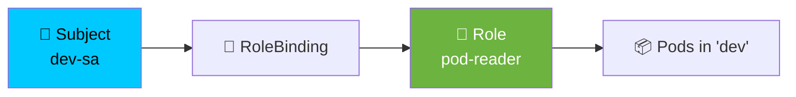

<div align="center">


<a href="https://kubernetes.io/docs/reference/kubectl/">
  
</a>


**[← Back to README](README.md)** &nbsp;•&nbsp; **[DevOps 0→Hero →](DEVOPS-0-TO-HERO.md)**

</div>

---

## 📑 Table of Contents

| # | Section | Jump |
| :---: | :--- | :--- |
| 1 | 🔤 Grammar of a kubectl command | [Go](#1--grammar-of-a-kubectl-command) |
| 2 | ⚙️ Configuration & Contexts | [Go](#2-️-configuration--contexts) |
| 3 | 📥 Getting Information | [Go](#3--getting-information) |
| 4 | 🔎 Describe, Explain & Inspect | [Go](#4--describe-explain--inspect) |
| 5 | ➕ Creating Resources | [Go](#5--creating-resources) |
| 6 | ✏️ Editing & Applying | [Go](#6-️-editing--applying) |
| 7 | 🗑️ Deleting Resources | [Go](#7-️-deleting-resources) |
| 8 | 🧪 Debugging & Logs | [Go](#8--debugging--logs) |
| 9 | 💻 Exec, Port-Forward & Copy | [Go](#9--exec-port-forward--copy) |
| 10 | 🔄 Rollouts & Updates | [Go](#10--rollouts--updates) |
| 11 | 📈 Scaling & Autoscaling | [Go](#11--scaling--autoscaling) |
| 12 | 🖥️ Nodes & Maintenance | [Go](#12-️-nodes--maintenance) |
| 13 | 🌐 Networking & Services | [Go](#13--networking--services) |
| 14 | 💾 Storage (PV / PVC) | [Go](#14--storage-pv--pvc) |
| 15 | 📝 ConfigMaps & Secrets | [Go](#15--configmaps--secrets) |
| 16 | 🗂️ Namespaces | [Go](#16-️-namespaces) |
| 17 | 🔐 RBAC & Security | [Go](#17--rbac--security) |
| 18 | 🎯 Labels, Selectors & Filters | [Go](#18--labels-selectors--filters) |
| 19 | 📤 Output Formatting & JSONPath | [Go](#19--output-formatting--jsonpath) |
| 20 | 📦 Helm Commands | [Go](#20--helm-commands) |
| 21 | 🐳 Docker & Containerd | [Go](#21--docker--containerd) |
| 22 | 🚀 Cluster Setup (minikube/kind) | [Go](#22--cluster-setup) |
| 23 | 🧰 Power Combos | [Go](#23--power-combos) |
| 24 | ⚠️ Common Mistakes | [Go](#24-️-common-mistakes) |

---

## 1. 🔤 Grammar of a kubectl command

> **Easy definition:** Almost every kubectl command follows the same shape. Learn the shape, and you can guess any command.

```
kubectl  <VERB>  <TYPE>  <NAME>  <FLAGS>

   │       │       │       │        │
   │       │       │       │        └── -n dev, -o yaml, -l app=web
   │       │       │       └────────── which one?      (optional)
   │       │       └────────────────── what kind?      (pods, svc, deploy)
   │       └────────────────────────── what action?    (get, apply, delete)
   └────────────────────────────────── the tool
```

**Examples:**

| Command | Reads as |
| :--- | :--- |
| `kubectl get pods` | get pods |
| `kubectl get pods -n dev` | get pods in namespace dev |
| `kubectl describe pod web-abc` | describe the pod named web-abc |
| `kubectl delete svc web -n dev` | delete service web in dev |
| `kubectl logs deploy/web -f` | logs from deployment web, follow |

### 🧠 The 8 verbs you actually need

| Verb | 🧒 Easy definition |
| :--- | :--- |
| `get` | 📖 Read / list |
| `describe` | 🔍 Read details + events |
| `apply` | ✅ Create or update from file |
| `create` | ➕ Create (fails if exists) |
| `delete` | 🗑️ Remove |
| `edit` | ✏️ Change live (⚠️ not for prod) |
| `logs` | 📜 Read container output |
| `exec` | 💻 Run a command inside |

### 🏷️ Short names (save typing)

<div align="center">

| Full | Short | Full | Short |
| :--- | :--- | :--- | :--- |
| `pods` | `po` | `services` | `svc` |
| `deployments` | `deploy` | `namespaces` | `ns` |
| `replicasets` | `rs` | `daemonsets` | `ds` |
| `statefulsets` | `sts` | `configmaps` | `cm` |
| `persistentvolumes` | `pv` | `persistentvolumeclaims` | `pvc` |
| `nodes` | `no` | `serviceaccounts` | `sa` |
| `ingresses` | `ing` | `endpoints` | `ep` |
| `networkpolicies` | `netpol` | `horizontalpodautoscalers` | `hpa` |
| `events` | `ev` | `customresourcedefinitions` | `crd` |

</div>

```bash
kubectl get po,svc,deploy   # instead of pods,services,deployments
kubectl get all             # things in the default namespace
```

### 💡 Tab completion (huge time saver)

```bash
# bash
source <(kubectl completion bash)
echo 'source <(kubectl completion bash)' >> ~/.bashrc
alias k=kubectl
complete -o default -F __start_kubectl k

# zsh
source <(kubectl completion zsh)
```

---

## 2. ⚙️ Configuration & Contexts

> **Easy definition:** A **context** is a bookmark = *which cluster + which namespace + which user*. You switch between clusters with contexts.

```bash
kubectl config view                          # 📖 show whole kubeconfig
kubectl config view --minify                 # just the active context
kubectl config get-contexts                  # 📋 list all contexts
kubectl config current-context               # 🎯 which one am I on?
kubectl config use-context prod-cluster      # 🔀 switch cluster
kubectl config rename-context old new        # ✏️ rename
kubectl config delete-context dev            # 🗑️ delete a context

kubectl config set-context --current --namespace=dev
kubectl config set-context dev --cluster=dev --user=dev --namespace=dev
```

### 🔗 Merge multiple kubeconfigs

```bash
export KUBECONFIG=~/.kube/config:~/.kube/config-prod:~/.kube/config-dev
kubectl config view --flatten > ~/.kube/merged-config
```

### 🛠️ Useful env vars

| Variable | Purpose |
| :--- | :--- |
| `KUBECONFIG` | Path(s) to kubeconfig files |
| `KUBE_EDITOR` | Editor used by `kubectl edit` |
| `KUBECTL_EXTERNAL_DIFF` | Better diffs, e.g. `colordiff` |

```bash
export KUBE_EDITOR="nano"
export KUBECTL_EXTERNAL_DIFF="delta"
```

---

## 3. 📥 Getting Information

### 📖 Basic listing

```bash
kubectl get pods                             # pods in current ns
kubectl get pods -A                          # ALL namespaces
kubectl get pods -n kube-system              # specific namespace
kubectl get pods -o wide                     # + node, IP
kubectl get nodes                            # cluster nodes
kubectl get nodes -o wide                    # + IPs, OS, runtime
kubectl get all -n web                       # everything in a namespace
kubectl get all -A                           # everything everywhere
```

### 🔍 Different views

```bash
kubectl get pod web-abc -o yaml              # full object as YAML
kubectl get pod web-abc -o json              # full object as JSON
kubectl get pods --show-labels               # show all labels
kubectl get pods -o wide --sort-by=.metadata.name
kubectl get pods -w                          # 👀 watch live changes
kubectl get pods --watch-only                # watch, don't list first
```

### 📦 Specific resource types

```bash
kubectl get deploy,rs,po,svc,ing,cm,secret -n web
kubectl get events --sort-by=.lastTimestamp -A
kubectl get events -A --field-selector type=Warning
kubectl get endpoints                        # Service → Pod IP mapping
kubectl get endpointslices                   # modern version
kubectl get hpa -A                           # autoscalers
kubectl get pv,pvc -A                        # storage
kubectl get netpol -A                        # network policies
kubectl get crd                              # custom resources
kubectl api-resources                        # ALL kinds available
kubectl api-versions                         # ALL API groups
```

### 📊 Resource usage

```bash
kubectl top nodes                            # CPU/memory per node
kubectl top pods                             # CPU/memory per pod
kubectl top pods -A --sort-by=memory         # hottest memory users
kubectl top pods --containers                # per container
```

> ⚠️ `kubectl top` requires the **Metrics Server** to be installed.

---

## 4. 🔎 Describe, Explain & Inspect

> **Easy definition:** `describe` is your **best friend**. When something is broken, the answer is almost always in the **Events** section at the bottom.

```bash
kubectl describe pod web-abc                 # ⭐ ALWAYS START HERE
kubectl describe node node-1                 # capacity, taints, allocated
kubectl describe svc web                     # endpoints, ports, selector
kubectl describe deploy web                  # rollout status, events
kubectl describe pvc data-pvc                # why is it stuck Pending?
kubectl describe ingress web                 # rules + TLS
kubectl describe hpa web                     # why isn't it scaling?
kubectl describe pdb web                     # disruption budget state
```

```bash
# 📖 Documentation right in the terminal (works offline!)
kubectl explain pod
kubectl explain pod.spec
kubectl explain deployment.spec.strategy.rollingUpdate
kubectl explain svc.spec.ports
```

```bash
# 🔗 Ownership tree — what created what?
kubectl get pod web-abc -o yaml | grep ownerReferences -A5
kubectl tree deploy web        # requires kubectl-tree plugin
```

---

## 5. ➕ Creating Resources

> **Easy definition:** `create` makes new things. It **fails** if the thing already exists. For repeatable workflows use `apply`.

```bash
# 🏃 Quick one-off pod
kubectl run nginx --image=nginx
kubectl run nginx --image=nginx --port=80
kubectl run tmp --image=busybox --restart=Never -- sleep 3600
kubectl run test --image=busybox --rm -it -- sh   # auto-delete after

# 🚀 Deployment
kubectl create deployment web --image=nginx --replicas=3
kubectl create deployment web --image=nginx --dry-run=client -o yaml > web.yaml

# 🌐 Service
kubectl create service clusterip web --tcp=80:8080
kubectl expose deployment web --port=80 --target-port=8080 --type=NodePort
kubectl expose deploy web --name=web-lb --type=LoadBalancer --port=80
kubectl expose deploy web --cluster-ip=None      # headless

# ✅ Job / CronJob
kubectl create job myjob --image=busybox -- echo hello
kubectl create cronjob mycron --image=busybox --schedule="*/5 * * * *" -- date

# 🗂️ Namespace
kubectl create namespace staging

# 🪪 ServiceAccount
kubectl create serviceaccount dev-sa -n dev

# 🔐 RBAC
kubectl create role pod-reader --verb=get,list,watch --resource=pods -n dev
kubectl create rolebinding read-pods --role=pod-reader \
  --serviceaccount=dev:dev-sa -n dev
kubectl create clusterrole node-reader --verb=get,list --resource=nodes
kubectl create clusterrolebinding node-reader-bind \
  --clusterrole=node-reader --serviceaccount=dev:dev-sa

# ⚙️ Resource limits
kubectl create quota dev-quota --hard=cpu=10,memory=20Gi,pods=50 -n dev
kubectl create limitrange defaults --default=cpu=500m --default-memory=256Mi -n dev
```

### 🧪 The golden `--dry-run` trick

> **Easy definition:** Generate YAML without actually creating anything. Best way to learn syntax!

```bash
kubectl create deployment web --image=nginx --dry-run=client -o yaml > web.yaml
kubectl run pod1 --image=nginx --dry-run=client -o yaml

# Server-side dry run (validates against the API, including admission)
kubectl apply -f web.yaml --dry-run=server
```

---

## 6. ✏️ Editing & Applying

> **Easy definition:** `apply` is the **declarative** way — describe what you want and Kubernetes figures out the difference.

```bash
kubectl apply -f deployment.yaml             # ⭐ the standard way
kubectl apply -f ./manifests/                # whole directory
kubectl apply -f ./manifests/ --recursive    # include subdirectories
kubectl apply -f https://example.com/x.yaml  # from a URL
kubectl apply -k ./overlays/prod             # Kustomize
kubectl apply -f - <<EOF
apiVersion: v1
kind: ConfigMap
metadata:
  name: quick-cm
data:
  key: value
EOF
```

### 🔍 Preview before applying

```bash
kubectl diff -f deployment.yaml              # ⭐ show what WILL change
kubectl apply -f x.yaml --dry-run=server     # validate only
kubectl apply --prune -l app=web -f ./dir/   # delete removed objects
```

### ✏️ Editing live objects

```bash
kubectl edit deployment web                  # opens $KUBE_EDITOR
kubectl edit svc web -o json                 # edit as JSON
kubectl patch deployment web -p '{"spec":{"replicas":5}}'
kubectl patch deploy web --type=json \
  -p='[{"op":"replace","path":"/spec/replicas","value":5}]'
kubectl set image deployment/web nginx=nginx:1.27
kubectl set env deployment/web LOG_LEVEL=debug
kubectl set resources deploy/web --limits=cpu=500m,memory=256Mi
```

> ⚠️ `kubectl edit` changes live state and won't be in Git. Use for emergencies only — then fix Git!

### 🔀 Shortcuts

```bash
kubectl replace -f web.yaml                  # full replace (destructive)
kubectl scale deploy web --replicas=5
kubectl annotate pod web-abc description="hotfix"
kubectl label pod web-abc env=prod --overwrite
kubectl label pod web-abc env-              # remove a label
```

---

## 7. 🗑️ Deleting Resources

```bash
kubectl delete pod web-abc
kubectl delete -f deployment.yaml            # delete what the file defines
kubectl delete deploy web
kubectl delete pods --all -n dev             # ⚠️ all pods in namespace
kubectl delete pods -l app=web               # by label
kubectl delete ns staging                    # deletes EVERYTHING inside
kubectl delete pvc data-pvc
```

### 🧟 Stuck in `Terminating`?

```bash
# 1. Check for finalizers
kubectl get pod web-abc -o json | grep finalizers -A3

# 2. Force delete (last resort)
kubectl delete pod web-abc --grace-period=0 --force

# 3. Patch finalizers away
kubectl patch pod web-abc -p '{"metadata":{"finalizers":[]}}' --type=merge

# 4. Stuck namespace
kubectl get ns stuck-ns -o json | jq '.spec.finalizers=[]' \
  | kubectl replace --raw "/api/v1/namespaces/stuck-ns/finalize" -f -
```

> 💡 **Graceful vs forced:** Normal delete sends SIGTERM and waits `terminationGracePeriodSeconds` (default 30s). `--force` sends SIGKILL immediately.

---

## 8. 🧪 Debugging & Logs

> ### 🔍 The 6-step debug flow
> ```
> 1. kubectl get pods        → what state is it in?
> 2. kubectl describe pod    → read the EVENTS at the bottom ⭐
> 3. kubectl logs            → app-level errors
> 4. kubectl exec -it        → go inside and look
> 5. kubectl get events -A   → cluster-wide view
> 6. kubectl get obj -o yaml → is the spec actually right?
> ```

### 📜 Logs

```bash
kubectl logs web-abc                          # 📜 current logs
kubectl logs web-abc --tail=50                # last 50 lines
kubectl logs web-abc -f                       # 👀 follow (like tail -f)
kubectl logs web-abc -c sidecar               # specific container
kubectl logs web-abc --previous                # 💥 the CRASHED instance
kubectl logs web-abc --since=1h               # since time
kubectl logs web-abc --since-time="2026-01-01T00:00:00Z"
kubectl logs web-abc --timestamps             # add timestamps
kubectl logs deploy/web                       # pod from deployment
kubectl logs -l app=web --all-containers=true # all matching pods
kubectl logs -n kube-system -l k8s-app=kube-dns --tail=100
kubectl logs job/myjob
```

### 🐞 Debugging

```bash
# 📋 Events — the story of what happened
kubectl get events --sort-by=.lastTimestamp
kubectl get events -A --field-selector type=Warning
kubectl get events --field-selector involvedObject.name=web-abc

# 🔍 Find problems
kubectl get pods -A --field-selector=status.phase!=Running
kubectl get pods -A | grep -Ev "Running|Completed"
kubectl get pods -A -o wide | grep -v Running

# 🧪 Temporary debug pod (with network tools)
kubectl run debug --rm -it --image=nicolaka/netshoot -- bash
kubectl run debug --rm -it --image=busybox -- sh

# 🔬 Ephemeral container in a live pod (k8s 1.23+)
kubectl debug -it web-abc --image=busybox --target=app
kubectl debug node/node-1 -it --image=busybox      # debug the NODE

# 🌐 DNS tests
kubectl exec -it web-abc -- nslookup kubernetes.default
kubectl exec -it web-abc -- nslookup web.dev.svc.cluster.local
kubectl exec -it web-abc -- cat /etc/resolv.conf

# 🔌 Test connectivity
kubectl exec -it web-abc -- wget -qO- http://web-svc
kubectl exec -it web-abc -- curl -v http://web-svc:80
```

### 🩺 Check component health

```bash
kubectl get componentstatuses                  # deprecated but useful
kubectl get --raw='/readyz?verbose'            # API server readiness
kubectl get --raw='/livez?verbose'
kubectl get --raw='/healthz'
kubectl get pods -n kube-system                # all system pods
kubectl get --raw='/metrics' | head -50        # raw metrics
kubectl cluster-info dump > cluster-state.txt  # full snapshot for support
```

---

## 9. 💻 Exec, Port-Forward & Copy

### 💻 Exec into a container

> **Easy definition:** Like SSH, but into a container.

```bash
kubectl exec -it web-abc -- /bin/sh            # interactive shell
kubectl exec -it web-abc -- /bin/bash
kubectl exec -it web-abc -c sidecar -- sh      # specific container
kubectl exec web-abc -- ls -la /app            # single command
kubectl exec web-abc -- env                    # see env variables
kubectl exec web-abc -- cat /etc/config/app.yaml
kubectl exec web-abc -- nslookup web-svc
```

> 💡 `-i` = interactive, `-t` = allocate a TTY. Together: `-it` for a shell.

### 🔌 Port forwarding

> **Easy definition:** Opens a tunnel from your laptop to a Pod/Service.

```bash
kubectl port-forward pod/web-abc 8080:80
kubectl port-forward svc/web 8080:80           # ⭐ use Services
kubectl port-forward deploy/web 8080:80
kubectl port-forward svc/web 8080:80 --address=0.0.0.0   # expose to LAN
kubectl port-forward svc/postgres 5432:5432    # access a DB locally
```

Then visit: `http://localhost:8080`

### 📁 Copy files

```bash
kubectl cp web-abc:/var/log/app.log ./app.log          # from pod
kubectl cp ./config.yaml web-abc:/etc/config/          # to pod
kubectl cp web-abc:/app/data ./   -c sidecar           # specific container
```

### 🔁 Attach to a running process

```bash
kubectl attach web-abc -it
```

---

## 10. 🔄 Rollouts & Updates

> **Easy definition:** A **rollout** is a controlled, reversible update of your app.

```bash
# 📊 Check status
kubectl rollout status deploy/web              # ⏳ wait for completion
kubectl rollout status deploy/web --timeout=120s
kubectl rollout history deploy/web             # 📜 list revisions
kubectl rollout history deploy/web --revision=2  # details of revision 2

# 🔙 Rollback
kubectl rollout undo deploy/web                # back one version
kubectl rollout undo deploy/web --to-revision=1  # to a specific revision

# 🔁 Restart (rolling restart, no config change)
kubectl rollout restart deploy/web             # ⭐ common trick

# ⏸️ Pause/resume (batch multiple changes into ONE rollout)
kubectl rollout pause deploy/web
kubectl rollout resume deploy/web
```

**Why `rollout restart` is so useful:** it forces all Pods to be recreated, picking up new **ConfigMaps/Secrets** (env vars don't update on their own!).

### 🔍 Check rollout progress

```bash
kubectl get rs -l app=web                       # see old + new ReplicaSets
kubectl get pods -l app=web --show-labels
kubectl describe deploy web | grep -A10 Events
```

---

## 11. 📈 Scaling & Autoscaling

```bash
# 📏 Manual scaling
kubectl scale deploy/web --replicas=5
kubectl scale deploy/web --replicas=0            # ⏸️ scale to zero
kubectl scale sts/db --replicas=3
kubectl scale --current-replicas=3 --replicas=5 deploy/web  # conditional

# 📈 Autoscaling (HPA)
kubectl autoscale deploy/web --min=2 --max=10 --cpu-percent=70
kubectl autoscale deploy/web --min=2 --max=10 \
  --memory-percent=80 --cpu-percent=70
kubectl get hpa -A
kubectl describe hpa web                         # why isn't it scaling?
kubectl delete hpa web

# 🚫 Temporarily stop an HPA fighting you
kubectl patch hpa web -p '{"spec":{"minReplicas":5}}'
```

### 🛠️ PodDisruptionBudget

```bash
kubectl get pdb -A
kubectl describe pdb web-pdb
kubectl delete pdb web-pdb
```

---

## 12. 🖥️ Nodes & Maintenance

> **Easy definition:** **cordon** = stop new Pods. **drain** = evict existing Pods. **uncordon** = allow again.

```bash
# 📋 Inspect nodes
kubectl get nodes
kubectl get nodes -o wide
kubectl top nodes
kubectl describe node node-1
kubectl get nodes --show-labels
kubectl get nodes -l node-role.kubernetes.io/worker

# 🚧 Maintenance workflow — memorize this order!
kubectl cordon node-1                            # 1️⃣ stop new pods
kubectl drain node-1 --ignore-daemonsets \
  --delete-emptydir-data                         # 2️⃣ evict pods
#   ... upgrade / reboot the node ...
kubectl uncordon node-1                          # 3️⃣ allow pods again

# 🏷️ Labels on nodes
kubectl label node node-1 disktype=ssd
kubectl label node node-1 disktype-             # remove
kubectl label node node-1 topology.kubernetes.io/zone=us-east-1a

# ☣️ Taints
kubectl taint nodes node-1 key=value:NoSchedule
kubectl taint nodes node-1 key=value:NoExecute
kubectl taint nodes node-1 key=value:NoSchedule-  # ⬅️ remove (note the -)

# 🗑️ Remove a node from the cluster
kubectl drain node-2 --ignore-daemonsets --delete-emptydir-data
kubectl delete node node-2
```

### 📊 Check node pressure

```bash
kubectl describe node node-1 | grep -A6 "Conditions"
kubectl describe node node-1 | grep -A8 "Allocated resources"
kubectl get pods -A --field-selector spec.nodeName=node-1
```

---

## 13. 🌐 Networking & Services

```bash
# 📋 Inspect
kubectl get svc -A
kubectl get svc -A -o wide
kubectl describe svc web
kubectl get endpoints web                        # ⭐ selector check
kubectl get endpointslices
kubectl get ing -A
kubectl get netpol -A

# ⚡ Quick Service
kubectl expose deploy/web --port=80 --target-port=8080 --type=ClusterIP
kubectl expose deploy/web --port=80 --type=NodePort
kubectl expose deploy/web --port=80 --type=LoadBalancer
kubectl expose deploy/web --cluster-ip=None --name=web-headless   # headless

# 🔄 Change type
kubectl patch svc web -p '{"spec":{"type":"NodePort"}}'

# 🔍 Debug networking
kubectl get svc web -o jsonpath='{.spec.clusterIP}'
kubectl run tmp --rm -it --image=busybox -- wget -qO- http://web-svc
kubectl exec -it web-abc -- curl -v http://web-svc:80
kubectl get svc web-svc -o yaml | grep -E "port|targetPort|nodePort"
```

### 🎯 The 3 ports — never confuse them again

```yaml
spec:
  type: NodePort
  ports:
    - port: 80           # 🎯 Service port (what others call)
      targetPort: 8080   # 🐳 Container port (app listens here)
      nodePort: 31000    # 🔌 Port on each node (30000-32767)
```

**Traffic path:** `nodePort → port → targetPort → container`

---

## 14. 💾 Storage (PV / PVC)

```bash
# 📋 Inspect
kubectl get pv                                  # cluster-scoped
kubectl get pvc -A
kubectl get storageclass                        # or: kubectl get sc
kubectl describe pvc data-pvc                   # ⭐ why is it Pending?
kubectl get pv -o wide

# 🔍 Find what's using storage
kubectl get pvc -A -o custom-columns=\
NAME:.metadata.name,NS:.metadata.namespace,\
STATUS:.status.phase,VOLUME:.spec.volumeName,CAP:.status.capacity.storage

# 🗑️ Delete (data loss if reclaimPolicy=Delete!)
kubectl delete pvc data-pvc
kubectl delete pv my-pv

# 🔓 Release a stuck PV
kubectl patch pv my-pv -p '{"spec":{"claimRef":null}}'
```

### 🚦 PVC states

```
Pending ──▶ Bound ──▶ Released ──▶ (Available | Failed)
   ▲           ▲
stuck here   good to go
```

| State | Meaning |
| :--- | :--- |
| `Pending` | No matching PV / StorageClass not provisioning |
| `Bound` | ✅ Attached and ready |
| `Released` | PVC deleted, PV retained (Retain policy) |
| `Failed` | Automatic reclaim failed |

---

## 15. 📝 ConfigMaps & Secrets

### 📝 ConfigMaps

```bash
kubectl create configmap app-config --from-literal=ENV=prod
kubectl create configmap app-config --from-file=app.properties
kubectl create configmap app-config --from-file=conf.d/
kubectl create configmap app-config --from-env-file=.env

kubectl get cm
kubectl get cm app-config -o yaml
kubectl describe cm app-config
kubectl edit cm app-config
kubectl delete cm app-config
```

### 🔐 Secrets

```bash
kubectl create secret generic db-secret \
  --from-literal=username=admin \
  --from-literal=password='S3cr3t!'

kubectl create secret generic app-secret --from-file=./secret.txt

kubectl create secret tls app-tls \
  --cert=path/to/tls.crt --key=path/to/tls.key

kubectl create secret docker-registry regcred \
  --docker-server=registry.example.com \
  --docker-username=user --docker-password=pass \
  --docker-email=me@example.com

# 🔎 Read a secret (base64 → plain)
kubectl get secret db-secret -o jsonpath='{.data.password}' | base64 -d
kubectl get secret db-secret -o jsonpath="{.data.*}" | base64 -d
kubectl get secret db-secret -o go-template='{{range $k,$v := .data}}{{$k}}={{$v|base64decode}}{{"\n"}}{{end}}'

# 📤 Export as env vars
export DB_PASS=$(kubectl get secret db-secret -o jsonpath='{.data.password}' | base64 -d)
```

> ⚠️ **base64 ≠ encryption.** Anyone with read access can decode. Use encryption at rest + RBAC + External Secrets / Sealed Secrets / Vault.

### 🔄 Force Pods to pick up config changes

```bash
kubectl rollout restart deploy/web    # ⭐ the standard fix
```

---

## 16. 🗂️ Namespaces

```bash
kubectl get ns
kubectl get ns --show-labels
kubectl create ns staging
kubectl describe ns staging
kubectl delete ns staging              # ⚠️ deletes everything inside

# 🎯 Set default namespace for this context (stops you typing -n)
kubectl config set-context --current --namespace=dev

# 🏷️ Label a namespace
kubectl label ns prod env=production
kubectl label ns prod pod-security.kubernetes.io/enforce=restricted
kubectl label ns prod istio-injection=enabled    # sidecar auto-injection

# 📊 Resource quotas & limits
kubectl create quota dev-quota --hard=cpu=10,memory=20Gi,pods=50 -n dev
kubectl get quota -n dev
kubectl describe quota dev-quota -n dev
kubectl create limitrange defaults \
  --default=cpu=500m --default-memory=256Mi -n dev
kubectl get limitrange -n dev

# 🔍 One-liner: list pods in every namespace with their namespace
kubectl get pods -A -o custom-columns=NS:.metadata.namespace,NAME:.metadata.name
```

---

## 17. 🔐 RBAC & Security

```bash
# 🔍 Check what YOU can do
kubectl auth can-i get pods
kubectl auth can-i '*' '*'                       # am I admin?
kubectl auth can-i --list                        # everything I can do
kubectl auth can-i get pods -n dev
kubectl auth can-i get pods --as=system:serviceaccount:dev:dev-sa
kubectl auth can-i create deployments --namespace=dev
kubectl auth can-i --list --as=system:serviceaccount:dev:dev-sa -n dev

# 🪪 ServiceAccounts
kubectl get sa -A
kubectl create sa app-sa -n dev
kubectl describe sa app-sa -n dev
kubectl delete sa app-sa -n dev

# 📜 Roles & Bindings
kubectl get roles,rolebindings -n dev
kubectl get clusterroles | head -30              # ⚠️ many built-in
kubectl get clusterrolebindings
kubectl describe clusterrole cluster-admin
kubectl create role pod-reader --verb=get,list,watch --resource=pods -n dev
kubectl create rolebinding read-pods --role=pod-reader \
  --user=jane -n dev
kubectl create rolebinding read-pods --role=pod-reader \
  --serviceaccount=dev:dev-sa -n dev
kubectl create clusterrole secret-reader --verb=get --resource=secrets
kubectl create clusterrolebinding sec-read \
  --clusterrole=secret-reader --group=dev-team

# 🧪 Test as another identity
kubectl get pods -n dev --as=system:serviceaccount:dev:dev-sa
kubectl get pods -n dev --as=jane
kubectl get pods -n dev --as=system:serviceaccount:dev:dev-sa \
  --as-group=developers
```

### 🧠 RBAC mental model

```
Role/ClusterRole      = the RULES      ("can get pods")
RoleBinding/CRBinding = the ASSIGNMENT ("dev-sa gets those rules")
Subject               = User | Group | ServiceAccount
```



### 🛡️ Security contexts

```bash
kubectl get pod web-abc -o jsonpath='{.spec.securityContext}'
kubectl get pod web-abc -o jsonpath='{.spec.containers[0].securityContext}'
kubectl get pod web-abc -o jsonpath='{.spec.serviceAccountName}'
```

### 🔎 Security audits

```bash
# 🚨 Find privileged containers
kubectl get pods -A -o json | jq -r '
  .items[] | select(.spec.containers[].securityContext.privileged==true)
  | "\(.metadata.namespace)/\(.metadata.name)"'

# 🚨 Find pods running as root
kubectl get pods -A -o json | jq -r '
  .items[] | select(.spec.securityContext.runAsNonRoot!=true)
  | "\(.metadata.namespace)/\(.metadata.name)"'

# 🚨 Find pods without resource limits
kubectl get pods -A -o json | jq -r '
  .items[] | select(.spec.containers[].resources.limits==null)
  | "\(.metadata.namespace)/\(.metadata.name)"'

# 🚨 Find secrets visible to a service account
kubectl auth can-i get secrets --as=system:serviceaccount:dev:dev-sa -n dev
```

---

## 18. 🎯 Labels, Selectors & Filters

```bash
# 🏷️ Labels
kubectl get pods --show-labels
kubectl get pods -l app=web                      # equality
kubectl get pods -l app=web,env=prod             # AND
kubectl get pods -l 'env in (prod,staging)'      # set membership
kubectl get pods -l 'tier notin (db)'            # exclusion
kubectl get pods -l app                              # key exists
kubectl label pod web-abc env=prod
kubectl label pod web-abc env=dev --overwrite
kubectl label pod web-abc env-                  # remove label
kubectl label pods --all tier=frontend

# 🔎 Field selectors (filter by field VALUE)
kubectl get pods --field-selector status.phase=Running
kubectl get pods --field-selector status.phase=Pending
kubectl get pods --field-selector spec.nodeName=node-1
kubectl get pods --field-selector metadata.namespace!=default
kubectl get events --field-selector type=Warning
kubectl get svc --field-selector metadata.name=kubernetes

# 🔗 Combine label + field selectors
kubectl get pods -l app=web --field-selector status.phase=Running
```

### ⚡ Killer one-liners

```bash
# 😴 Pods NOT running
kubectl get pods -A --field-selector=status.phase!=Running

# 💥 All crashlooping pods
kubectl get pods -A | grep -i crashloop

# 🐳 All containers and their images
kubectl get pods -A -o custom-columns=\
NS:.metadata.namespace,POD:.metadata.name,\
CONTAINER:.spec.containers[*].name,IMAGE:.spec.containers[*].image

# 📊 Pods with restart counts (find flappers)
kubectl get pods -A -o custom-columns=\
NS:.metadata.namespace,POD:.metadata.name,\
RESTARTS:.status.containerStatuses[*].restartCount --sort-by=.metadata.name

# 🗑️ Delete all evicted pods
kubectl get pods -A | grep Evicted | awk '{print $1, $2}' \
  | xargs -n2 kubectl delete pod -n
```

---

## 19. 📤 Output Formatting & JSONPath

> **Easy definition:** `-o` controls the **shape** of the output. JSONPath lets you pluck out a single value.

```bash
kubectl get pods                    # table (default)
kubectl get pods -o wide            # more columns
kubectl get pods -o yaml            # full YAML
kubectl get pods -o json            # full JSON
kubectl get pods -o name            # just resource/name
kubectl get pods -o jsonpath='{.items[0].metadata.name}'
kubectl get pods -o custom-columns=NAME:.metadata.name,STATUS:.status.phase
kubectl get pods -o go-template='{{range .items}}{{.metadata.name}}{{"\n"}}{{end}}'
```

### 📚 JSONPath cheat sheet

| Goal | Command |
| :--- | :--- |
| All pod names | `kubectl get pods -o jsonpath='{.items[*].metadata.name}'` |
| Pod IPs | `kubectl get pods -o jsonpath='{.items[*].status.podIP}'` |
| All images | `kubectl get pods -o jsonpath='{.items[*].spec.containers[*].image}'` |
| Service ClusterIP | `kubectl get svc web -o jsonpath='{.spec.clusterIP}'` |
| Node InternalIP | `kubectl get nodes -o jsonpath='{.items[*].status.addresses[?(@.type=="InternalIP")].address}'` |
| All namespaces | `kubectl get ns -o jsonpath='{.items[*].metadata.name}'` |
| Custom table | `kubectl get pods -o custom-columns=NAME:.metadata.name,IP:.status.podIP` |
| Sorted by age | `kubectl get pods --sort-by=.metadata.creationTimestamp` |
| Sorted by restarts | `kubectl get pods --sort-by='.status.containerStatuses[0].restartCount'` |

### 🔧 `jq` for power users

```bash
kubectl get pods -A -o json | jq -r '.items[] | "\(.metadata.namespace)/\(.metadata.name)"'
kubectl get pods -o json | jq '.items[].spec.containers[].image'
kubectl get pods -o json | jq -r '.items[] | select(.status.phase!="Running") | .metadata.name'
kubectl get nodes -o json | jq '.items[].status.capacity'
```

---

## 20. 📦 Helm Commands

> **Easy definition:** Helm = **App Store for Kubernetes**. Charts instead of piles of YAML.

```bash
# 🏪 Repositories
helm repo add bitnami https://charts.bitnami.com/bitnami
helm repo add stable https://charts.helm.sh/stable
helm repo update
helm repo list
helm repo remove bitnami

# 🔍 Search
helm search repo nginx
helm search hub postgres
helm search repo bitnami/ --versions | head -20

# 📖 Inspect before installing (⭐ always do this)
helm show chart bitnami/nginx
helm show values bitnami/nginx > values.yaml
helm show readme bitnami/nginx
helm template my-nginx bitnami/nginx          # render without installing

# 🚀 Install
helm install my-nginx bitnami/nginx -n web --create-namespace
helm install my-nginx bitnami/nginx -f values.yaml
helm install my-nginx bitnami/nginx --set replicaCount=3
helm install my-nginx bitnami/nginx --dry-run --debug   # ⭐ test first
helm install my-nginx bitnami/nginx --wait --timeout 5m

# 📋 Manage releases
helm list
helm list -A
helm list --all-namespaces --deployed --failed
helm status my-nginx -n web
helm history my-nginx -n web

# 🔄 Update & rollback
helm upgrade my-nginx bitnami/nginx -f values.yaml
helm upgrade --install my-nginx bitnami/nginx -f values.yaml  # ⭐ idempotent
helm rollback my-nginx 1 -n web
helm uninstall my-nginx -n web
helm uninstall my-nginx -n web --keep-history

# 🧩 Create your own chart
helm create mychart
helm lint mychart
helm package mychart
helm install test ./mychart --dry-run --debug
```

---

## 21. 🐳 Docker & Containerd

```bash
# 🐳 Docker (building images — still fine!)
docker build -t myapp:1.0 .
docker buildx build --platform linux/amd64,linux/arm64 -t myapp:1.0 .
docker push registry.example.com/myapp:1.0
docker tag myapp:1.0 registry.example.com/myapp:1.0
docker save myapp:1.0 -o myapp.tar
docker load -i myapp.tar

# ⬇️ Load an image into kind / minikube
kind load docker-image myapp:1.0 --name dev
minikube image load myapp:1.0

# 🔍 containerd (for nodes using containerd as runtime)
crictl ps                          # running containers
crictl images                      # local images
crictl logs <container-id>
crictl pods
nerdctl images                     # docker-like CLI for containerd

# 🩺 Node-level debugging (run ON the node)
crictl ps -a | grep <pod-name>
journalctl -u kubelet -f           # kubelet logs
journalctl -u containerd -f        # runtime logs
systemctl status kubelet
```

---

## 22. 🚀 Cluster Setup

### 🔧 minikube

```bash
minikube start --cpus=4 --memory=8g --kubernetes-version=v1.30.0
minikube start --driver=docker
minikube status
minikube stop
minikube delete --all
minikube dashboard                       # opens the web UI
minikube ip                              # cluster IP
minikube service web --url               # get a URL for a Service
minikube tunnel                          # for LoadBalancer services
minikube image load myapp:1.0
minikube addons enable ingress
minikube addons enable metrics-server
minikube addons list
minikube ssh                             # shell into the node
```

### 📦 kind

```bash
kind create cluster --name dev
kind create cluster --config cluster.yaml     # multi-node
kind get clusters
kind get nodes --name dev
kind delete cluster --name dev
kind load docker-image myapp:1.0 --name dev
kind export logs ./logs --name dev
```

**Multi-node `cluster.yaml`:**

```yaml
kind: Cluster
apiVersion: kind.x-k8s.io/v1alpha4
nodes:
  - role: control-plane
  - role: worker
  - role: worker
```

### 🧩 k3d

```bash
k3d cluster create dev --agents 2
k3d cluster list
k3d cluster delete dev
k3d kubeconfig merge dev
```

### ℹ️ Cluster info

```bash
kubectl cluster-info
kubectl version --short
kubectl api-versions
kubectl config view
```

---

## 23. 🧰 Power Combos

> **Easy definition:** Recipes that combine commands to answer real questions fast.

### 🔍 "What's broken right now?"

```bash
kubectl get pods -A | grep -Ev "Running|Completed"
```

### 🔥 "Which pods are restarting a lot?"

```bash
kubectl get pods -A --sort-by='.status.containerStatuses[0].restartCount' \
  -o custom-columns=NS:.metadata.namespace,POD:.metadata.name,\
RESTARTS:.status.containerStatuses[0].restartCount
```

### 🐳 "What images are running in this cluster?"

```bash
kubectl get pods -A -o jsonpath='{range .items[*]}{.spec.containers[*].image}{"\n"}{end}' | sort -u
```

### 📊 "What's eating my cluster's memory?"

```bash
kubectl top pods -A --sort-by=memory | head -20
```

### 🌐 "Why does this Service have no endpoints?"

```bash
kubectl get endpoints web -o yaml
kubectl get pods -l "$(kubectl get svc web -o jsonpath='{.spec.selector | to_entries | map("\(.key)=\(.value)") | join(",")}')"
```

### 🗑️ "Delete all Evicted pods"

```bash
kubectl get pods -A | grep Evicted | awk '{print $1, $2}' | xargs -n2 kubectl delete pod -n
```

### 💥 "Emergency: restart everything in a namespace"

```bash
kubectl rollout restart deploy -n web     # only works with Deployments
```

### 🔎 "Find which node a pod is on"

```bash
kubectl get pod web-abc -o jsonpath='{.spec.nodeName}'
```

### 🧹 "Clean up everything in a namespace"

```bash
kubectl delete all --all -n web
kubectl delete pvc --all -n web
kubectl delete cm --all -n web
```

### 📸 "Snapshot cluster state for troubleshooting"

```bash
kubectl cluster-info dump > /tmp/cluster-dump.txt
kubectl get all -A -o yaml > /tmp/all-objects.yaml
kubectl get events -A --sort-by=.lastTimestamp > /tmp/events.txt
```

### 🎯 "Which pods have no resource limits?"

```bash
kubectl get pods -A -o json | jq -r '
  .items[] | select(.spec.containers[]?.resources.limits == null)
  | "\(.metadata.namespace)/\(.metadata.name)"'
```

### ⏱️ "Watch a rollout finish"

```bash
kubectl rollout restart deploy/web && kubectl rollout status deploy/web
```

### 🔁 "Quick pod to test DNS/network"

```bash
kubectl run nettest --rm -it --restart=Never --image=nicolaka/netshoot \
  -- bash -c "nslookup web-svc && curl -sS http://web-svc"
```

---

## 24. ⚠️ Common Mistakes

<div align="center">

| ❌ Mistake | ✅ Correct | Why |
| :--- | :--- | :--- |
| `kubectl get pods` (empty result) | `kubectl get pods -n <ns>` | Wrong namespace |
| Port mismatch debugging | Check `port` → `targetPort` → `containerPort` | Most common Service bug |
| `kubectl delete pod` then wondering why it's back | It's owned by a ReplicaSet | Delete the Deployment instead |
| `kubectl edit` in production | Git + `kubectl apply` | Drift, no audit trail |
| `image: nginx:latest` | `nginx:1.27.3` | Unpredictable deployments |
| No `resources.requests` | Always set requests | HPA + QoS need them |
| Env var not updating after ConfigMap change | `kubectl rollout restart` | Env vars are read once |
| Secrecy assumption on Secrets | base64 ≠ encryption | Use encryption + RBAC |
| `kubectl delete ns` on prod | Double-check context! | Deletes everything inside |
| Aggressive liveness probe | Add a `startupProbe` | Prevents CrashLoopBackOff |
| Editing a pod directly | Edit the Deployment | Pods are ephemeral |
| Deleting a PVC to "fix" it | Check reclaimPolicy first | Real data may be deleted |

</div>

### 🚨 Safety habits

```bash
# 1. Always check WHERE you are before destructive commands
kubectl config current-context

# 2. Use --dry-run=server first
kubectl apply -f risky.yaml --dry-run=server

# 3. Use kubectl diff before applying
kubectl diff -f risky.yaml

# 4. Never use `--force` unless you truly mean it

# 5. Add aliases that print the context
alias k='kubectl'
alias kk='kubectl config current-context'
alias kx='kubectl config use-context'
```

---

<div align="center">

## 🎓 You now know kubectl


### 🔗 Keep going

[](README.md)
[](DEVOPS-0-TO-HERO.md)
[](https://kubernetes.io/docs/reference/kubectl/)

<br/>


</div>
