<div align="center">


<a href="#">
  
</a>


**[← Kubernetes Notes](README.md)** &nbsp;•&nbsp; **[kubectl Commands →](COMMANDS.md)**

</div>

---

## 🎯 What is DevOps? (In One Simple Paragraph)

> **DevOps = Removing the wall between people who WRITE code and people who RUN code.**
>
> Instead of developers throwing code over a fence to ops, DevOps says: *let's automate everything so code goes from a developer's laptop to production safely, quickly, and repeatedly — without humans doing manual steps.*

**In one line:**
> 🧒 **DevOps = Automating the journey of code from laptop → production.**

### 🔄 The DevOps Lifecycle

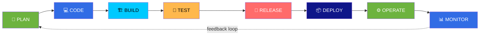

> 💡 **The infinity loop:** the arrow from MONITOR back to PLAN is the whole point. DevOps never stops improving.

---

## 🗺️ The 9-Phase Master Map

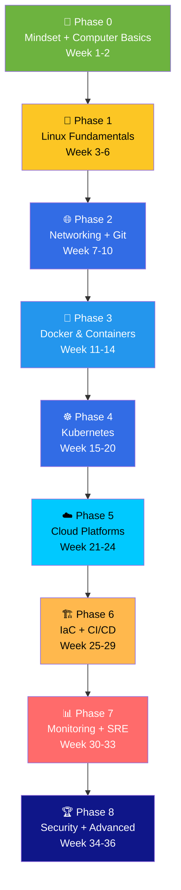

<div align="center">

| Phase | Topic | Weeks | Difficulty | Core Outcome |
| :---: | :--- | :---: | :---: | :--- |
| 0 | 🌱 Mindset & Basics | 1–2 | ⭐ | Know what DevOps is |
| 1 | 🐧 Linux | 3–6 | ⭐⭐ | Comfortable in the terminal |
| 2 | 🌐 Networking + Git | 7–10 | ⭐⭐ | Understand how data moves |
| 3 | 🐳 Docker | 11–14 | ⭐⭐⭐ | Containerize anything |
| 4 | ☸️ **Kubernetes** | 15–20 | ⭐⭐⭐⭐ | Run apps at scale |
| 5 | ☁️ Cloud | 21–24 | ⭐⭐⭐ | Deploy to the real world |
| 6 | 🏗️ IaC + CI/CD | 25–29 | ⭐⭐⭐⭐ | Automate everything |
| 7 | 📊 Monitoring + SRE | 30–33 | ⭐⭐⭐ | Know when things break |
| 8 | 🏆 Security + Advanced | 34–36 | ⭐⭐⭐⭐⭐ | Production ready |

</div>

---

<div align="center">

# 🌱 PHASE 0 — Mindset & Computer Basics

### *Week 1–2 · ⭐ Beginner*

</div>

> **Goal:** Understand *why* DevOps exists and get your computer ready.

### 📚 What to Learn

| Topic | 🧒 Easy definition |
| :--- | :--- |
| **What is DevOps** | Automating code from laptop → production |
| **SDLC** | The life of software: plan → code → test → deploy → monitor |
| **Agile & Scrum** | Working in small, fast 2-week cycles |
| **Waterfall vs Agile** | Big-bang release vs small continuous releases |
| **CI / CD** | Automatically test (CI) and ship (CD) code |
| **Virtual Machines** | A computer inside a computer |
| **How the internet works** | Browser → DNS → server → response |

### 🛠️ Setup Your Toolkit

```bash
# Terminal — pick ONE and master it
#   Linux: bash or zsh
#   Windows: WSL2 (strongly recommended!) or Git Bash

# Editor
#   VS Code + extensions: Docker, Kubernetes, YAML, GitLens, Remote-SSH

# Accounts to create
#   GitHub      → code hosting
#   Docker Hub  → container registry
#   AWS free tier OR Azure free OR GCP free → cloud
```

### 🎯 Milestone

- [ ] Can explain DevOps to a non-technical friend
- [ ] WSL2 or a Linux VM installed and working
- [ ] GitHub account created, VS Code configured
- [ ] Understand: repo, commit, branch, PR (concepts)

---

<div align="center">

# 🐧 PHASE 1 — Linux Fundamentals

### *Week 3–6 · ⭐⭐ Core Skill*

</div>

> **🧒 Why Linux first?** Because **95% of servers run Linux**. Docker containers are Linux. Kubernetes nodes are Linux. You cannot do DevOps without Linux.

### 📚 The Linux Syllabus

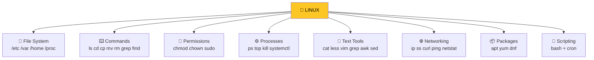

### 🔑 The 30 Commands You Must Know

<details open>
<summary><b>📁 Navigation & Files</b></summary>

```bash
pwd                     # where am I?
ls -lah                 # list all, human-readable sizes
cd /var/log             # change directory
cd ~                    # go home
cd -                    # go back to previous directory
mkdir -p a/b/c          # make nested directories
touch file.txt          # create an empty file
cp -r src dest          # copy recursively
mv old new              # move/rename
rm -rf dir              # ⚠️ delete recursively (careful!)
find / -name "*.log"    # search for files
locate filename         # fast file search
tree -L 2               # show directory tree
```

</details>

<details>
<summary><b>📝 Viewing & Editing Files</b></summary>

```bash
cat file.txt            # print whole file
less file.txt           # page through (q to quit)
head -20 file.txt       # first 20 lines
tail -50 file.txt       # last 50 lines
tail -f app.log         # ⭐ follow a live log
wc -l file.txt          # count lines
nano file.txt           # beginner editor
vim file.txt           # pro editor (learn this!)
```

</details>

<details>
<summary><b>🔍 Text Processing (superpowers)</b></summary>

```bash
grep -rn "error" /var/log/        # search recursively with line numbers
grep -i "fail" app.log            # case-insensitive
grep -v "DEBUG" app.log           # invert — lines NOT matching
awk '{print $1, $4}' file.txt     # print columns 1 and 4
sed 's/old/new/g' file.txt        # find and replace
cut -d: -f1 /etc/passwd           # split on ':' and take field 1
sort file.txt | uniq -c           # count unique lines
tr 'a-z' 'A-Z' < file.txt         # translate characters
```

> 💡 **The classic combo:** `cat access.log | awk '{print $1}' | sort | uniq -c | sort -rn | head -10`
> = **top 10 IP addresses hitting your server.**

</details>

<details>
<summary><b>⚙️ Processes & Services</b></summary>

```bash
ps aux                  # all running processes
ps aux | grep nginx     # find a specific one
top                     # live CPU/memory view
htop                    # prettier version
kill 1234               # graceful stop
kill -9 1234            # ⚠️ force kill
systemctl status nginx  # is this service running?
systemctl start nginx
systemctl stop nginx
systemctl restart nginx
systemctl enable nginx  # start on boot
journalctl -u nginx -f  # follow service logs
```

</details>

<details>
<summary><b>🔐 Permissions</b></summary>

```bash
chmod 755 script.sh     # rwxr-xr-x
chmod +x script.sh      # make executable
chown user:group file   # change owner
sudo command            # run as root
whoami                  # who am I?
id                      # my uid/gid/groups
```

**Reading permissions:** `rwxr-xr-x`

```
 rwx r-x r-x
 │   │   └── others: read + execute
 │   └────── group:  read + execute
 └────────── owner:  read + write + execute

r=4  w=2  x=1
755 = rwx(7) r-x(5) r-x(5)
644 = rw-(6) r--(4) r--(4)
```

</details>

<details>
<summary><b>🌐 Network Tools</b></summary>

```bash
ip a                    # my IP addresses
ip route                # routing table
ss -tulpn               # ⭐ open ports (replaces netstat)
ping google.com         # is it reachable?
curl -v https://site    # verbose HTTP request
wget https://file.zip   # download
dig example.com         # DNS lookup
nslookup example.com    # DNS lookup (older)
traceroute google.com   # path to a host
nc -zv host 443         # is this port open?
```

</details>

### 📜 Bash Scripting — Start Here

```bash
#!/bin/bash
# 🚀 Every good script starts with these two lines
set -euo pipefail
#   e = exit on error
#   u = error on undefined variable
#   o pipefail = catch errors inside pipes

# Variables
NAME="DevOps"
echo "Hello, $NAME!"

# Conditionals
if [ -f "/etc/nginx/nginx.conf" ]; then
  echo "✅ Nginx config found"
else
  echo "❌ Nginx not installed"
fi

# Loops
for server in web1 web2 web3; do
  echo "Checking $server..."
  ping -c1 "$server" > /dev/null && echo "  ✅ up" || echo "  ❌ down"
done

# Functions
backup() {
  local src="$1"
  local dest="/backups/$(date +%Y%m%d)-$(basename "$src").tar.gz"
  tar -czf "$dest" "$src"
  echo "📦 Backed up to $dest"
}
backup /etc/nginx

# Exit codes
exit 0
```

### ⏰ Cron — Scheduling Tasks

```
┌───────── minute (0-59)
│ ┌─────── hour (0-23)
│ │ ┌───── day of month (1-31)
│ │ │ ┌─── month (1-12)
│ │ │ │ ┌─ day of week (0-6, Sun=0)
* * * * * command
```

| Schedule | Meaning |
| :--- | :--- |
| `0 2 * * *` | Daily at 2 AM |
| `*/15 * * * *` | Every 15 minutes |
| `0 0 * * 0` | Every Sunday |
| `@reboot` | On system start |

```bash
crontab -e              # edit my cron jobs
crontab -l              # list my cron jobs
```

### 🎯 Milestone Project: **Server Health Monitor**

Build a bash script that:
- [ ] Checks CPU, memory, and disk usage
- [ ] Checks if Nginx/any service is running (restart if not)
- [ ] Checks disk space > 80% → alert
- [ ] Logs everything to `/var/log/healthcheck.log`
- [ ] Runs every 5 minutes via cron

---

<div align="center">

# 🌐 PHASE 2 — Networking + Git

### *Week 7–10 · ⭐⭐ Essential*

</div>

> **🧒 Why networking?** Because DevOps is *always* debugging "why can't A talk to B?" — and the answer is always networking.

## 🌐 Part A — Networking

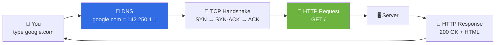

### 📚 The Networking Syllabus

<details open>
<summary><b>What you MUST know</b></summary>

| Topic | 🧒 Easy definition |
| :--- | :--- |
| **OSI 7 layers** | A model of how data travels (Physical → Application) |
| **TCP vs UDP** | TCP = reliable, ordered. UDP = fast, no guarantee |
| **IP addresses** | A computer's street address on a network |
| **Subnetting & CIDR** | Dividing a network. `192.168.1.0/24` = 256 addresses |
| **Ports** | Doors on a house: 80=HTTP, 443=HTTPS, 22=SSH, 3306=MySQL |
| **DNS** | The internet's phonebook (name → IP) |
| **HTTP/HTTPS** | How browsers talk to servers |
| **TLS/SSL** | Encryption for traffic (the 🔒 in your browser) |
| **Load Balancers** | A traffic cop spreading requests across servers |
| **Firewalls** | A security guard blocking unwanted traffic |
| **Proxy vs Reverse Proxy** | Proxy = acts for the client. Reverse proxy = acts for the server |
| **NAT** | Many private IPs share one public IP |

</details>

### 🔑 Key Commands

```bash
# 🔍 Check what's listening
ss -tulpn
lsof -i :80

# 🌐 Test connectivity
curl -v https://example.com
curl -I https://example.com          # headers only
curl -o file.zip https://x/y.zip     # download
curl -X POST -d '{"a":1}' -H "Content-Type: application/json" http://api/

# 📖 DNS
dig example.com
dig +short example.com
dig MX example.com

# 🚪 Port checks
nc -zv host 443
telnet host 80

# 🔎 Trace the path
traceroute google.com
mtr google.com
```

### 🧠 The OSI Model (memorize the order)

| # | Layer | 🧒 Easy definition | Examples |
| :---: | :--- | :--- | :--- |
| 7 | **A**pplication | What the user sees | HTTP, DNS, SMTP, SSH |
| 6 | **P**resentation | Formatting/encryption | TLS, JPEG, ASCII |
| 5 | **S**ession | Managing conversations | Sockets, RPC |
| 4 | **T**ransport | Reliable delivery | TCP, UDP |
| 3 | **N**etwork | Routing between networks | IP, ICMP, Routers |
| 2 | **D**ata Link | Local delivery (MAC) | Ethernet, Switches |
| 1 | **P**hysical | Actual wires/radio | Cables, WiFi |

> 🧠 **Mnemonic (top→bottom):** **A**ll **P**eople **S**eem **T**o **N**eed **D**ata **P**rocessing

---

## 🐙 Part B — Git & Version Control

> **🧒 Easy definition:** Git is a **time machine for your code**. It saves every version so you can go back, work in parallel, and collaborate without overwriting each other.

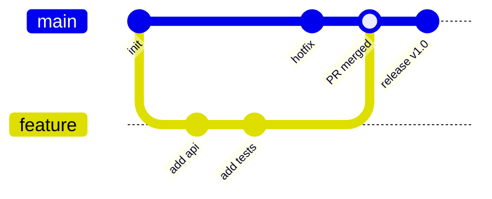

### 🔑 Essential Git Commands

```bash
# ⚙️ Setup (once)
git config --global user.name "Your Name"
git config --global user.email "you@example.com"
git config --global init.defaultBranch main

# 🚀 Start
git init
git clone https://github.com/user/repo.git

# 📝 Daily workflow
git status                       # what changed?
git add .                        # stage everything
git add file.txt                 # stage one file
git commit -m "feat: add login"  # save a snapshot
git push origin main             # upload
git pull origin main             # download + merge

# 🌿 Branching
git branch                       # list branches
git branch feature-x             # create
git checkout feature-x           # switch
git switch -c feature-x          # create + switch (modern)
git merge feature-x              # merge into current
git branch -d feature-x          # delete

# 🔍 History
git log --oneline --graph --all
git diff                         # unstaged changes
git diff --staged                # staged changes
git show abc1234                 # show a commit
git blame file.txt               # who wrote each line?

# 🔙 Undo
git restore file.txt             # discard unstaged changes
git restore --staged file.txt    # unstage
git reset --soft HEAD~1          # undo commit, keep changes staged
git reset --hard HEAD~1          # ⚠️ undo commit, DELETE changes
git revert abc1234               # safe undo (makes a new commit)

# 🏷️ Tags (for releases)
git tag v1.0.0
git tag -a v1.0.0 -m "Release 1.0"
git push origin --tags
```

### 🌳 Branching Strategy (Git Flow)

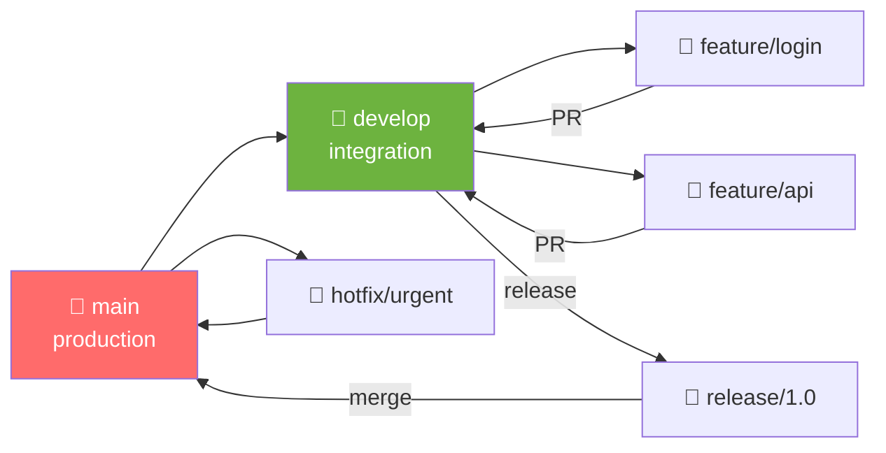

| Branch | Purpose |
| :--- | :--- |
| `main` | Always production-ready 🚨 |
| `develop` | Where features come together |
| `feature/*` | One branch per feature |
| `release/*` | Preparing a release |
| `hotfix/*` | Urgent production fixes |

### 📝 Commit Message Convention (Conventional Commits)

```
feat: add user login endpoint
fix: correct null pointer in payment service
docs: update README with setup steps
style: reformat code, no logic change
refactor: extract validation into helper
test: add unit tests for auth
chore: bump dependency versions
ci: add GitHub Actions workflow
perf: cache database queries
```

> 💡 Good commits make `git log` a readable story. Future-you will be grateful.

### 🎯 Milestone Project: **Team Collaboration Simulation**

- [ ] Create a repo with `main` + `develop` branches
- [ ] Add branch protection rules on `main`
- [ ] Create 2 feature branches, each with a PR
- [ ] Resolve a merge conflict on purpose
- [ ] Tag a release `v1.0.0`
- [ ] Write a `CONTRIBUTING.md`

---

<div align="center">

# 🐳 PHASE 3 — Docker & Containers

### *Week 11–14 · ⭐⭐⭐ Game Changer*

</div>

> **🧒 Easy definition:** A container is a **lunchbox** 📦 — your app plus everything it needs to run, packed together so it works the same everywhere.
>
> **"It works on my machine"** → solved forever.

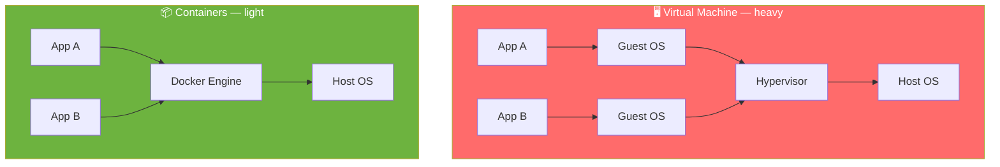

### ⚖️ VM vs Container

| | 🖥️ Virtual Machine | 📦 Container |
| :--- | :--- | :--- |
| Size | GBs | MBs |
| Boot time | Minutes | Seconds (or less) |
| OS | Full guest OS each | Shares host kernel |
| Isolation | Very strong | Good (namespaces/cgroups) |
| Density | Few per host | Many per host |
| Use case | Strong isolation, different OS | App packaging, microservices |

### 📚 Docker Syllabus

<details open>
<summary><b>🧱 Core Concepts</b></summary>

| Term | 🧒 Easy definition |
| :--- | :--- |
| **Image** | A read-only blueprint (the recipe 📋) |
| **Container** | A running instance of an image (the cooked dish 🍜) |
| **Dockerfile** | The instructions to build an image |
| **Registry** | A warehouse of images (Docker Hub) |
| **Volume** | Persistent storage for containers |
| **Network** | How containers talk to each other |
| **Layer** | Each Dockerfile instruction = one cached layer |
| **Tag** | A version label (`nginx:1.27`) |

</details>

### 🐳 Essential Docker Commands

```bash
# 🏃 Containers
docker run -d -p 8080:80 --name web nginx        # detached, port mapped
docker run -it ubuntu bash                       # interactive
docker run --rm -it alpine sh                    # auto-delete on exit
docker run -d -e ENV=prod -v /data:/app/data myapp
docker ps                                        # running containers
docker ps -a                                     # all, including stopped
docker stop web && docker rm web
docker logs -f web                               # follow logs
docker exec -it web bash                         # go inside
docker inspect web                               # full JSON details
docker stats                                     # live resource usage

# 🖼️ Images
docker build -t myapp:1.0 .
docker build -t myapp:1.0 -f Dockerfile.prod .
docker images
docker rmi myapp:1.0
docker tag myapp:1.0 user/myapp:1.0
docker push user/myapp:1.0
docker pull nginx:1.27

# 🧹 Cleanup
docker system prune -a            # ⚠️ remove unused everything
docker volume prune
docker image prune

# 💾 Volumes
docker volume create mydata
docker volume ls
docker run -v mydata:/data nginx
docker run -v $(pwd):/app myapp     # bind mount

# 🌐 Networks
docker network create mynet
docker network ls
docker network inspect mynet
docker run --network mynet --name db postgres
```

### 📄 The Perfect Dockerfile

```dockerfile
# ─────────────────────────────────────────────
# 🏗️ STAGE 1 — BUILD
# ─────────────────────────────────────────────
FROM node:20-alpine AS builder

WORKDIR /app

# 📦 Copy dependency files FIRST (layer caching!)
COPY package*.json ./
RUN npm ci --only=production

# 🏗️ Copy source and build
COPY . .
RUN npm run build

# ─────────────────────────────────────────────
# 🚀 STAGE 2 — RUNTIME (much smaller image!)
# ─────────────────────────────────────────────
FROM node:20-alpine

# 🏷️ Metadata
LABEL maintainer="you@example.com"

# 🔐 Security: don't run as root
RUN addgroup -S appgroup && adduser -S appuser -G appgroup

WORKDIR /app

# 📋 Only copy what we need
COPY --from=builder /app/node_modules ./node_modules
COPY --from=builder /app/dist ./dist
COPY package*.json ./

USER appuser

EXPOSE 3000

# 🩺 Health check
HEALTHCHECK --interval=30s --timeout=3s --start-period=5s --retries=3 \
  CMD wget -qO- http://localhost:3000/health || exit 1

CMD ["node", "dist/index.js"]
```

### 📝 Dockerfile Best Practices

| ✅ Do | ❌ Don't |
| :--- | :--- |
| Use small bases (`alpine`, `distroless`) | Use `ubuntu:latest` for a Go app |
| Multi-stage builds | Ship build tools in production |
| `.dockerignore` file | Copy `node_modules` and `.git` |
| Pin versions (`node:20-alpine`) | Use `:latest` |
| Run as non-root `USER` | Run everything as root |
| Order layers: deps → source | Copy source before installing deps |
| One process per container | Run a whole init system |
| Add `HEALTHCHECK` | Assume the app is healthy |

**`.dockerignore`:**

```
node_modules
.git
.env
*.log
dist
coverage
Dockerfile
README.md
```

### 🧩 Docker Compose (multi-container apps)

```yaml
version: "3.9"

services:
  web:
    build: .
    ports: ["3000:3000"]
    environment:
      - DB_HOST=db
    depends_on:
      db:
        condition: service_healthy
    networks: [appnet]

  db:
    image: postgres:16
    environment:
      POSTGRES_PASSWORD: secret
      POSTGRES_DB: myapp
    volumes:
      - pgdata:/var/lib/postgresql/data
    healthcheck:
      test: ["CMD-SHELL", "pg_isready -U postgres"]
      interval: 5s
    networks: [appnet]

  redis:
    image: redis:7-alpine
    networks: [appnet]

volumes:
  pgdata:

networks:
  appnet:
```

```bash
docker compose up -d          # start everything
docker compose ps              # status
docker compose logs -f web      # follow logs
docker compose exec web bash    # shell in
docker compose down             # stop + remove
docker compose down -v          # also delete volumes ⚠️
```

### 🎯 Milestone Project: **Containerize a Full-Stack App**

- [ ] Take any Node/Python/Go app with a database
- [ ] Write a multi-stage Dockerfile
- [ ] Get the image under 100 MB
- [ ] Run everything with Docker Compose
- [ ] Add health checks to all services
- [ ] Push images to Docker Hub
- [ ] Document it in a README

---

<div align="center">

# ☸️ PHASE 4 — Kubernetes

### *Week 15–20 · ⭐⭐⭐⭐ The Big One*

</div>

> **🧒 Easy definition:** Docker runs containers on **one machine**. Kubernetes runs containers on **many machines**, and keeps them alive automatically.

👉 **Full details: [README.md](README.md)** &nbsp;|&nbsp; **Commands: [COMMANDS.md](COMMANDS.md)**

### 📚 What to Learn (in this order)

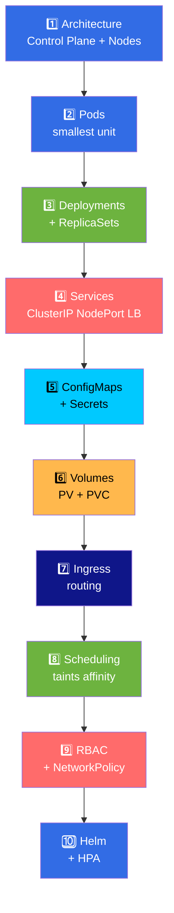

### 🎯 Milestone Project: **Deploy a Microservices App**

- [ ] 3+ services (frontend, API, database)
- [ ] Each in its own Deployment + Service
- [ ] ConfigMaps and Secrets for config
- [ ] PVC for the database
- [ ] Ingress for external access
- [ ] HPA for autoscaling
- [ ] Resource requests and limits everywhere
- [ ] Readiness + liveness probes everywhere
- [ ] Deploy with Helm (write your own chart)

---

<div align="center">

# ☁️ PHASE 5 — Cloud Platforms

### *Week 21–24 · ⭐⭐⭐*

</div>

> **🧒 Easy definition:** The cloud is **someone else's computer** 🖥️ that you rent by the second.

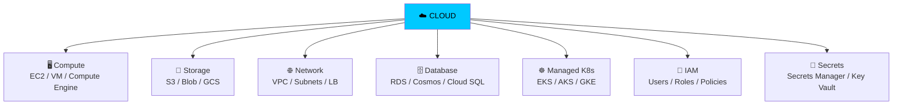

### ⚖️ Pick ONE cloud (don't try all three)

<div align="center">

| | ☁️ AWS | ☁️ Azure | ☁️ GCP |
| :--- | :--- | :--- | :--- |
| **Market share** | 🥇 Largest | 🥈 Second | 🥉 Third |
| **Managed K8s** | EKS | AKS | GKE ⭐ (best) |
| **Compute** | EC2 | Virtual Machines | Compute Engine |
| **Storage** | S3 | Blob Storage | Cloud Storage |
| **Serverless** | Lambda | Functions | Cloud Functions |
| **IaC** | CloudFormation / CDK | ARM / Bicep | Deployment Manager |
| **Best for** | Jobs, breadth, ecosystem | Enterprise, Microsoft shops | Data, ML, easiest K8s |

</div>

> 💡 **Recommendation:** Starting out? **AWS** — most job postings, most documentation. Love simplicity and Kubernetes? **GCP**.

### 📚 Cloud Syllabus

<details open>
<summary><b>Core services everyone must know</b></summary>

| Category | AWS | 🧒 Easy definition |
| :--- | :--- | :--- |
| **Compute** | EC2 | A rented virtual machine |
| **Object Storage** | S3 | Infinite file storage (buckets) |
| **Block Storage** | EBS | A virtual hard disk |
| **Networking** | VPC | Your own private network in the cloud |
| **Subnets** | Public / Private | Public = internet-facing; Private = internal |
| **Gateway** | Internet Gateway | The door to the internet |
| **Load Balancer** | ALB / NLB | Spreads traffic across servers |
| **DNS** | Route 53 | Domain name management |
| **Database** | RDS | Managed SQL database |
| **NoSQL** | DynamoDB | Managed key-value store |
| **Cache** | ElastiCache | Managed Redis/Memcached |
| **Queue** | SQS | Message queue for async work |
| **Containers** | ECR + EKS | Registry + managed Kubernetes |
| **Serverless** | Lambda | Run code without servers |
| **IAM** | IAM | Who can do what in your account |
| **Secrets** | Secrets Manager | Secure secret storage |
| **Monitoring** | CloudWatch | Logs, metrics, alarms |
| **IaC** | CloudFormation | Define infrastructure as YAML |

</details>

### 🔑 Get Started with the AWS CLI

```bash
# ⚙️ Configure
aws configure                    # sets key, secret, region, format
aws sts get-caller-identity      # who am I?

# 🖥️ EC2
aws ec2 describe-instances --query 'Reservations[].Instances[].InstanceId'
aws ec2 start-instances --instance-ids i-1234567890
aws ec2 stop-instances --instance-ids i-1234567890

# 🪣 S3
aws s3 ls
aws s3 mb s3://my-bucket-name
aws s3 cp file.txt s3://my-bucket/
aws s3 sync ./local s3://my-bucket/backup/
aws s3 rm s3://my-bucket/file.txt

# ☸️ EKS
aws eks list-clusters
aws eks update-kubeconfig --name my-cluster --region us-east-1
kubectl get nodes

# 📊 CloudWatch logs
aws logs describe-log-groups
aws logs tail /aws/lambda/my-function --follow
```

### 🎯 Milestone Project: **Deploy to the Cloud**

- [ ] Create a VPC with public + private subnets
- [ ] Launch an EC2 instance, SSH into it
- [ ] Host a static site on S3 + CloudFront
- [ ] Create an RDS database in a private subnet
- [ ] Deploy your K8s app to EKS (or GKE/AKS)
- [ ] Set up IAM roles with least privilege
- [ ] Create a budget alert 💰 (avoid surprise bills!)

> ⚠️ **Cloud cost warning:** Set up a **budget alarm on day one**. Free tier limits are easy to exceed. Always `terraform destroy` / delete resources after practice.

---

<div align="center">

# 🏗️ PHASE 6 — Infrastructure as Code + CI/CD

### *Week 25–29 · ⭐⭐⭐⭐ The Automation Phase*

</div>

> **🧒 Easy definition:**
> **IaC** = Instead of clicking buttons in a cloud console, you **write code that creates infrastructure**. Repeatable, reviewable, versioned.
> **CI/CD** = Every time you push code, robots **test it and ship it** automatically.

## 🏗️ Part A — Terraform (Infrastructure as Code)

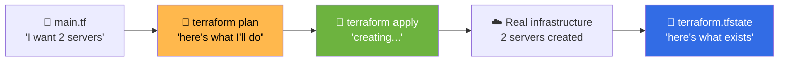

### 🔑 Terraform Commands

```bash
terraform init          # download providers
terraform fmt           # format code
terraform validate      # check syntax
terraform plan          # ⭐ preview changes (always do this)
terraform apply         # create infrastructure
terraform apply -auto-approve
terraform destroy       # ⚠️ tear everything down
terraform state list    # what am I managing?
terraform output        # show outputs
terraform import <resource> <id>    # bring existing infra under management
```

### 📄 Example: Terraform for AWS

```hcl
# ─────────────────────────────────────────────
# 🔧 Provider
# ─────────────────────────────────────────────
terraform {
  required_version = ">= 1.6"
  required_providers {
    aws = {
      source  = "hashicorp/aws"
      version = "~> 5.0"
    }
  }

  # 💾 Remote state (critical for teams!)
  backend "s3" {
    bucket = "my-terraform-state"
    key    = "prod/terraform.tfstate"
    region = "us-east-1"
  }
}

provider "aws" {
  region = var.aws_region
}

# ─────────────────────────────────────────────
# 🔤 Variables
# ─────────────────────────────────────────────
variable "aws_region" {
  default = "us-east-1"
}

variable "instance_count" {
  type    = number
  default = 2
}

# ─────────────────────────────────────────────
# 🌐 VPC + Subnets
# ─────────────────────────────────────────────
resource "aws_vpc" "main" {
  cidr_block           = "10.0.0.0/16"
  enable_dns_hostnames = true

  tags = {
    Name        = "main-vpc"
    Environment = "prod"
    ManagedBy   = "terraform"
  }
}

resource "aws_subnet" "public" {
  count             = 2
  vpc_id            = aws_vpc.main.id
  cidr_block        = cidrsubnet(aws_vpc.main.cidr_block, 8, count.index)
  availability_zone = data.aws_availability_zones.available.names[count.index]

  tags = { Name = "public-${count.index}" }
}

data "aws_availability_zones" "available" {
  state = "available"
}

# ─────────────────────────────────────────────
# 🖥️ EC2 Instances
# ─────────────────────────────────────────────
resource "aws_instance" "web" {
  count         = var.instance_count
  ami           = data.aws_ami.ubuntu.id
  instance_type = "t3.micro"
  subnet_id     = aws_subnet.public[count.index].id

  tags = {
    Name = "web-${count.index}"
  }
}

data "aws_ami" "ubuntu" {
  most_recent = true
  owners      = ["099720109477"] # Canonical

  filter {
    name   = "name"
    values = ["ubuntu/images/hvm-ssd/ubuntu-22.04-amd64-server-*"]
  }
}

# ─────────────────────────────────────────────
# 📤 Outputs
# ─────────────────────────────────────────────
output "instance_ips" {
  value       = aws_instance.web[*].public_ip
  description = "Public IPs of web servers"
}
```

### 🧠 Terraform Concepts

| Concept | 🧒 Easy definition |
| :--- | :--- |
| **Provider** | The plugin that talks to AWS/GCP/Azure |
| **Resource** | Something you want to exist |
| **Data source** | Read existing info (don't create) |
| **Variable** | An input you can customize |
| **Output** | A value Terraform prints out |
| **State** | Terraform's memory of what exists |
| **Module** | A reusable bundle of resources |
| **Workspace** | Separate states for dev/prod |

### 🔄 How Terraform Works

```
1. WRITE    → you describe desired infra in .tf files
2. INIT     → download providers
3. PLAN     → compare desired state vs actual state
4. APPLY    → make reality match, save to state file
5. DESTROY  → tear it all down
```

> 💡 **Golden rule:** Always commit `.tf` files, **never** commit `.tfstate` (it contains secrets!). Use remote state in S3/GCS with locking.

---

## 🔁 Part B — CI/CD Pipelines

> **🧒 Easy definition:**
> **CI (Continuous Integration)** = every push, automatically build + test.
> **CD (Continuous Delivery/Deployment)** = every passing build, automatically ship it.

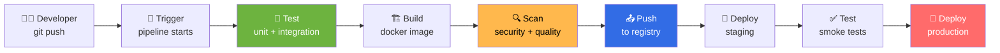

### ⚖️ Popular CI/CD Tools

<div align="center">

| Tool | 🧒 Easy definition | Best for |
| :--- | :--- | :--- |
| **GitHub Actions** ⭐ | Pipelines inside GitHub | Everything — start here |
| **GitLab CI** | Pipelines inside GitLab | Self-hosted, all-in-one |
| **Jenkins** | The old reliable workhorse | Legacy / on-prem |
| **CircleCI** | Cloud pipelines | Speed |
| **ArgoCD** | GitOps deployer for K8s | Kubernetes ⭐ |
| **Flux** | GitOps deployer for K8s | Lightweight |
| **Tekton** | K8s-native pipelines | Cloud native |

</div>

### 📄 GitHub Actions Workflow

```yaml
# .github/workflows/ci-cd.yaml
name: 🚀 CI/CD Pipeline

on:
  push:
    branches: [main, develop]
  pull_request:
    branches: [main]

env:
  IMAGE: ghcr.io/${{ github.repository }}

jobs:
  # ─────────────────────────────────────────────
  # 🧪 TEST
  # ─────────────────────────────────────────────
  test:
    runs-on: ubuntu-latest
    steps:
      - name: 📥 Checkout
        uses: actions/checkout@v4

      - name: 🟢 Setup Node
        uses: actions/setup-node@v4
        with:
          node-version: "20"
          cache: "npm"

      - name: 📦 Install
        run: npm ci

      - name: 🧪 Lint & Test
        run: |
          npm run lint
          npm test -- --coverage

      - name: 📊 Upload coverage
        uses: codecov/codecov-action@v4

  # ─────────────────────────────────────────────
  # 🔍 SECURITY SCAN
  # ─────────────────────────────────────────────
  security:
    runs-on: ubuntu-latest
    steps:
      - uses: actions/checkout@v4

      - name: 🔍 Trivy — filesystem scan
        uses: aquasecurity/trivy-action@master
        with:
          scan-type: fs
          severity: CRITICAL,HIGH

  # ─────────────────────────────────────────────
  # 🏗️ BUILD & PUSH
  # ─────────────────────────────────────────────
  build:
    needs: [test, security]
    if: github.ref == 'refs/heads/main'
    runs-on: ubuntu-latest
    permissions:
      contents: read
      packages: write
    steps:
      - uses: actions/checkout@v4

      - name: 🔐 Login to registry
        uses: docker/login-action@v3
        with:
          registry: ghcr.io
          username: ${{ github.actor }}
          password: ${{ secrets.GITHUB_TOKEN }}

      - name: 🏗️ Build & push
        uses: docker/build-push-action@v5
        with:
          push: true
          tags: |
            ${{ env.IMAGE }}:latest
            ${{ env.IMAGE }}:${{ github.sha }}
          cache-from: type=gha
          cache-to: type=gha,mode=max

  # ─────────────────────────────────────────────
  # 🚀 DEPLOY
  # ─────────────────────────────────────────────
  deploy:
    needs: build
    if: github.ref == 'refs/heads/main'
    runs-on: ubuntu-latest
    environment: production
    steps:
      - uses: actions/checkout@v4

      - name: 🔐 Setup kubeconfig
        run: |
          mkdir -p ~/.kube
          echo "${{ secrets.KUBE_CONFIG }}" | base64 -d > ~/.kube/config

      - name: 🚀 Roll out
        run: |
          kubectl set image deployment/web \
            web=${{ env.IMAGE }}:${{ github.sha }} -n prod
          kubectl rollout status deployment/web -n prod --timeout=180s

      - name: 🔙 Rollback on failure
        if: failure()
        run: kubectl rollout undo deployment/web -n prod
```

### 🔄 ArgoCD — GitOps for Kubernetes

```yaml
apiVersion: argoproj.io/v1alpha1
kind: Application
metadata:
  name: myapp
  namespace: argocd
spec:
  project: default
  source:
    repoURL: https://github.com/me/myapp-manifests
    targetRevision: main
    path: overlays/prod
  destination:
    server: https://kubernetes.default.svc
    namespace: prod
  syncPolicy:
    automated:
      prune: true       # delete resources removed from git
      selfHeal: true    # revert manual changes
    syncOptions:
      - CreateNamespace=true
```

> 🧒 **GitOps in one line:** **Git is the single source of truth.** The cluster constantly pulls from Git and makes itself match. No one runs `kubectl apply` by hand.

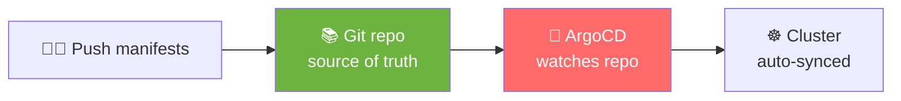

### 🧩 Kustomize (multi-environment YAML)

```yaml
# overlays/prod/kustomization.yaml
apiVersion: kustomize.config.k8s.io/v1beta1
kind: Kustomization
namespace: prod

resources:
  - ../../base

patches:
  - target: { kind: Deployment, name: web }
    patch: |-
      - op: replace
        path: /spec/replicas
        value: 5

images:
  - name: myapp
    newTag: v1.2.3
```

```bash
kubectl apply -k overlays/prod
kustomize build overlays/prod
```

### 🎯 Milestone Project: **Full Automated Pipeline**

- [ ] GitHub repo with a containerized app
- [ ] GitHub Actions: test → scan → build → push
- [ ] Terraform creating the EKS cluster
- [ ] ArgoCD syncing manifests from a Git repo
- [ ] PR environment for preview deploys
- [ ] Auto-rollback on failed deployment
- [ ] Status badge in the README

---

<div align="center">

# 📊 PHASE 7 — Monitoring, Logging & SRE

### *Week 30–33 · ⭐⭐⭐*

</div>

> **🧒 Easy definition:**
> **Monitoring** = knowing your system is healthy **before** users complain.
> **Observability** = being able to ask *any* question about your system.

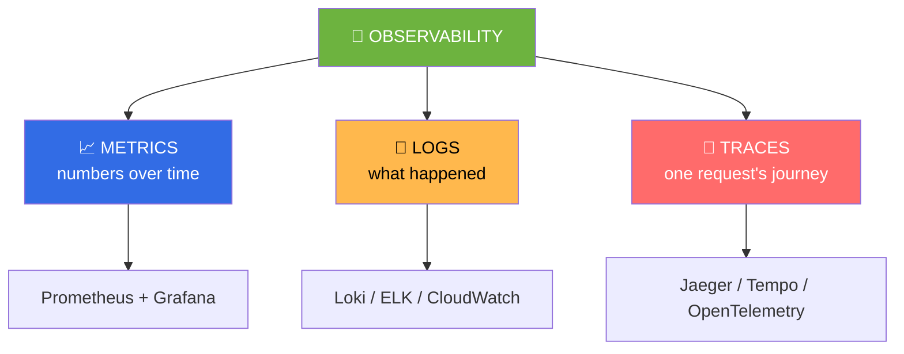

### 🧩 The Three Pillars

| Pillar | 🧒 Easy definition | Tools |
| :--- | :--- | :--- |
| **📈 Metrics** | Numbers: CPU %, requests/sec, latency | Prometheus, Grafana, Datadog |
| **📜 Logs** | Text: "user 42 failed login at 10:03" | ELK, Loki, Splunk |
| **🔗 Traces** | One request's full path through services | Jaeger, Tempo, OpenTelemetry |

### 📊 Prometheus + Grafana

```bash
# Install with Helm (the easy way)
helm repo add prometheus-community https://prometheus-community.github.io/helm-charts
helm repo update
helm install monitoring prometheus-community/kube-prometheus-stack \
  -n monitoring --create-namespace

kubectl get pods -n monitoring
kubectl port-forward -n monitoring svc/monitoring-grafana 3000:80
# → open http://localhost:3000  (admin / prom-operator)
```

### 📈 The 4 Golden Signals (Google SRE)

> **Easy definition:** If you monitor only four things, monitor these.

| Signal | 🧒 Easy definition | Ask |
| :--- | :--- | :--- |
| **Latency** | How long requests take | "Is it slow?" |
| **Traffic** | How many requests | "How busy are we?" |
| **Errors** | How many fail | "Is it broken?" |
| **Saturation** | How full are we | "Are we about to break?" |

### 🛑 SLI, SLO, SLA, Error Budget

<div align="center">

| Term | 🧒 Easy definition | Example |
| :--- | :--- | :--- |
| **SLI** | The number you measure | 99.2% of requests succeeded |
| **SLO** | The target you promise yourself | "99.9% success rate" |
| **SLA** | The promise to customers (with penalties) | "99.95% or you get a refund" |
| **Error Budget** | How much failure you can afford | 0.1% of a month = ~43 min |

</div>

> 💡 **Error budget thinking:** If you have budget left, ship faster. If you've burned it, freeze features and fix reliability.

### 🚨 Alerting Best Practices

| ✅ Good alerts | ❌ Bad alerts |
| :--- | :--- |
| Based on **symptoms** (users affected) | Based on every metric spike |
| Include a **runbook link** | Just say "something is wrong" |
| **Actionable** — someone can fix it | Noise no one can act on |
| Have **severity levels** | Everything is P1 🚨 |
| Use **multi-window** burn-rate alerts | Sleeping through ping-pong alerts |

```yaml
# Prometheus alert example
groups:
  - name: app
    rules:
      - alert: HighErrorRate
        expr: |
          sum(rate(http_requests_total{status=~"5.."}[5m]))
          / sum(rate(http_requests_total[5m])) > 0.05
        for: 5m
        labels:
          severity: critical
        annotations:
          summary: "Error rate above 5%"
          description: "{{ $value | humanizePercentage }} of requests are failing"
          runbook: "https://wiki/runbooks/high-error-rate"
```

### 🎯 Milestone Project: **Full Observability Stack**

- [ ] Prometheus + Grafana via Helm
- [ ] Dashboards for CPU, memory, latency, error rate
- [ ] Loki collecting all pod logs
- [ ] Alerts firing to Slack
- [ ] SLO dashboard with error budget
- [ ] Node exporter on every node (DaemonSet)

---

<div align="center">

# 🏆 PHASE 8 — Security & Advanced

### *Week 34–36 · ⭐⭐⭐⭐⭐*

</div>

> **🧒 Easy definition:** DevSecOps = security is **built in from the start**, not bolted on at the end.

### 🔐 The DevSecOps Pipeline

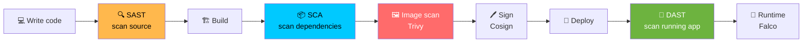

### 🛡️ Security Toolbox

| Area | Tools | 🧒 Easy definition |
| :--- | :--- | :--- |
| **Source scanning** | SonarQube, Semgrep | Find bugs before building |
| **Dependency scan** | Snyk, Dependabot, Trivy | Find CVEs in libraries |
| **Image scan** | Trivy, Grype, Clair | Find CVEs in containers |
| **Image signing** | Cosign, Sigstore | Prove an image is really yours |
| **Secrets** | Vault, Sealed Secrets, SOPS | Keep secrets out of Git |
| **K8s policy** | OPA Gatekeeper, Kyverno | Enforce rules automatically |
| **Runtime security** | Falco, Tetragon | Catch bad behavior live |
| **Network** | Cilium, Calico | Enforce NetworkPolicies |
| **Cloud** | IAM, KMS, GuardDuty | Cloud-native protection |

### 🔒 Top 10 Security Rules

| # | Rule |
| :---: | :--- |
| 1 | 🔑 Never commit secrets — ever |
| 2 | 🪪 Use least-privilege IAM/RBAC |
| 3 | 📌 Pin and scan every image |
| 4 | 🚫 Never run containers as root |
| 5 | 🔐 Encrypt data in transit AND at rest |
| 6 | 🛡️ Default-deny network policies |
| 7 | 🔄 Patch and upgrade regularly |
| 8 | 📜 Enable audit logging everywhere |
| 9 | 🧱 Rotate credentials automatically |
| 10 | 🧪 Assume breach — design for detection |

### 🚀 Advanced Topics (After the Basics)

<div align="center">

| Topic | 🧒 Easy definition | When to learn |
| :--- | :--- | :--- |
| **Service Mesh** (Istio, Linkerd) | A network layer that handles mTLS, retries, traffic splitting | After K8s is solid |
| **Operators & CRDs** | Teach K8s new tricks with custom controllers | After K8s is solid |
| **Serverless** (Lambda, Knative) | Run code without thinking about servers | Anytime |
| **Kubernetes Security** (CKS) | Hardening clusters | After CKA |
| **Platform Engineering** | Building a self-service platform for devs | Senior level |
| **FinOps** | Controlling cloud costs | Senior level |
| **Chaos Engineering** | Deliberately break things to test resilience | Senior level |
| **Multi-cloud / Hybrid** | Run across providers | Senior level |
| **eBPF** | Kernel-level observability & security | Advanced |

</div>

### 🎯 Milestone Project: **Production-Grade Platform**

- [ ] Signed and scanned container images
- [ ] Secrets in Vault, never in Git
- [ ] Kyverno/Gatekeeper policies enforcing best practices
- [ ] Falco runtime alerts
- [ ] mTLS between services
- [ ] Full audit logging
- [ ] Documented incident response runbook

---

<div align="center">

# 📅 The 36-Week Study Plan

</div>

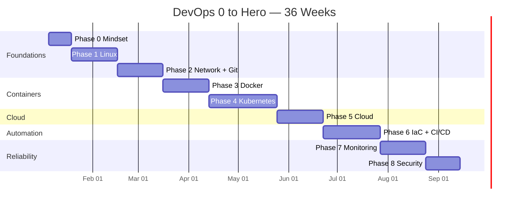

### ⏰ Daily Routine

<div align="center">

| Time | Activity |
| :---: | :--- |
| 🌅 **1 hour** | Learn a concept (read/watch) |
| 🌞 **2 hours** | Hands-on practice (type every command!) |
| 🌙 **30 min** | Document in your own notes repo |
| 📅 **Weekend** | Build the milestone project |

</div>

> 💡 **The 80/20 rule for DevOps learning:** **80% hands-on, 20% reading.** Watching tutorials without typing is the #1 reason people stall.

---

<div align="center">

# 🛠️ The Complete Tool Stack

</div>

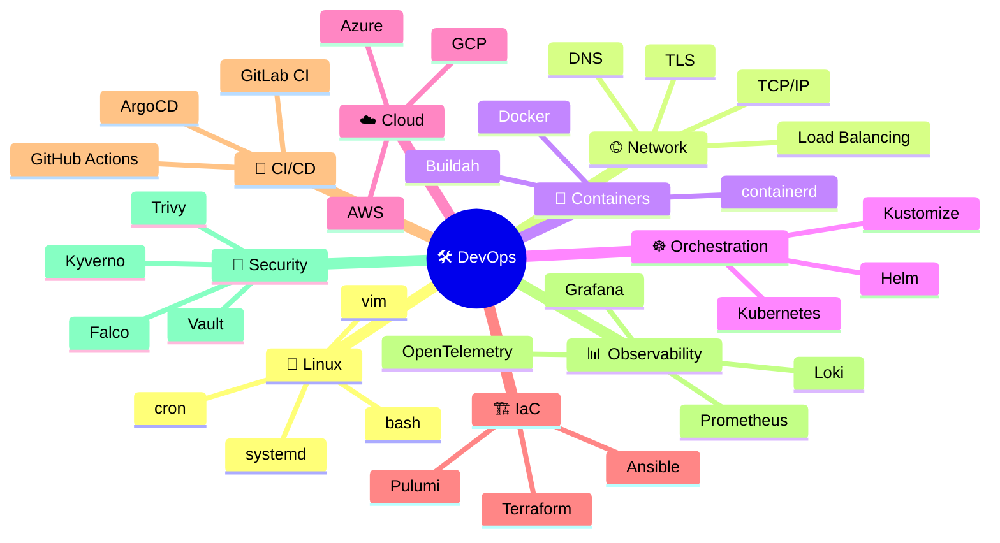

<div align="center">

| Layer | 🥇 Learn First | 🥈 Then | 🥉 Advanced |
| :--- | :--- | :--- | :--- |
| **OS** | 🐧 Linux | Shell scripting | Kernel tuning |
| **VCS** | 🐙 Git | Branch strategies | Monorepo tooling |
| **Containers** | 🐳 Docker | Compose | BuildKit, containerd |
| **Orchestration** | ☸️ Kubernetes | Helm | Operators, CRDs |
| **IaC** | 🏗️ Terraform | Ansible | Pulumi, Crossplane |
| **CI/CD** | 🔁 GitHub Actions | ArgoCD | Tekton, Spinnaker |
| **Cloud** | ☁️ AWS basics | EKS + IAM | Multi-cloud |
| **Observability** | 📊 Prometheus | Grafana | OpenTelemetry |
| **Security** | 🔐 IAM + RBAC | Trivy, Vault | Falco, eBPF |
| **Language** | 🐍 Python | Bash | Go |

</div>

---

<div align="center">

# 🎒 12 Portfolio Projects (Build These!)

</div>

> **🧒 Why projects?** Nobody hires you for watching videos. They hire you for **things you built**. Every project below is resume-worthy.

<div align="center">

| # | Project | Teaches |
| :---: | :--- | :--- |
| 1 | 🩺 **Server Health Monitor** (Bash) | Linux, scripting, cron |
| 2 | 🌐 **Static Site on S3 + CloudFront** | Cloud basics, DNS, HTTPS |
| 3 | 🐳 **Multi-container App with Compose** | Docker, networking, volumes |
| 4 | 🧩 **CI Pipeline with GitHub Actions** | Automation, testing |
| 5 | 📦 **Private Container Registry** | Registries, auth, scanning |
| 6 | ☸️ **3-Tier App on Kubernetes** | K8s core objects |
| 7 | 📜 **Own Helm Chart** | Templating, releases |
| 8 | 🏗️ **Terraform VPC + EKS** | IaC, networking, cloud |
| 9 | 🔁 **Full GitOps Pipeline (ArgoCD)** | GitOps, automation |
| 10 | 📊 **Prometheus + Grafana Stack** | Observability, alerting |
| 11 | 🔐 **Secrets Management with Vault** | Security, secret rotation |
| 12 | 🚀 **Complete Platform: CI/CD + K8s + Monitoring** ⭐ | Everything together |

</div>

### ⭐ Project 12 — The Capstone Architecture

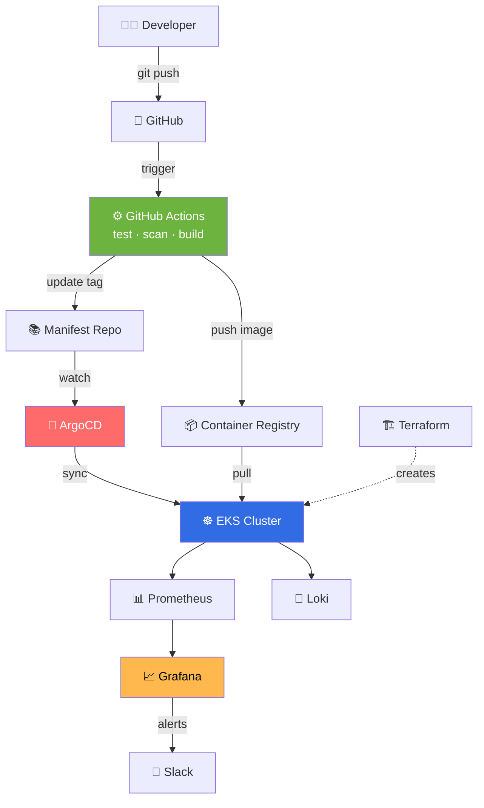

**If you can build this and explain it, you are job-ready.** 🏆

---

<div align="center">

# 💼 Getting Hired

</div>

### 📄 Resume Keywords That Matter

<div align="center">

| ✅ Include | ❌ Avoid |
| :--- | :--- |
| "Reduced deploy time from 45min → 5min" | "Responsible for deployments" |
| "Migrated 12 services to Kubernetes" | "Worked on Kubernetes" |
| "Built CI/CD with GitHub Actions + ArgoCD" | "Familiar with CI/CD" |
| "Cut AWS spend 32% via right-sizing" | "Helped with cloud costs" |
| "Achieved 99.95% uptime with SLOs" | "Maintained uptime" |

</div>

> 💡 **The magic formula:** **Action + Tool + Measurable Result.** Numbers get interviews.

### 🎤 Interview Questions by Topic

<details open>
<summary><b>🐧 Linux</b></summary>

- What happens when you type a URL in a browser and press Enter?
- How do you find which process is using port 8080?
- Explain file permissions `755` vs `644`.
- How do you check disk usage? What if the disk is full?
- Difference between a process and a thread?
- How do you troubleshoot high CPU load?
</details>

<details>
<summary><b>🐳 Docker</b></summary>

- Difference between an image and a container?
- How does a multi-stage build reduce image size?
- What is the difference between `COPY` and `ADD`?
- How do you persist data in containers?
- Container is running but the app is unreachable — debug it.
- How do you reduce Docker image size?
</details>

<details>
<summary><b>☸️ Kubernetes</b></summary>

👉 **Full list of 14 K8s questions: [README.md § Revision](README.md#-step-19--revision--interview-quick-fire)**

- What happens when you `kubectl apply` a Deployment?
- Deployment vs StatefulSet vs DaemonSet?
- How does a Service route traffic to Pods?
- Pod is in CrashLoopBackOff — walk me through debugging.
- How do you achieve zero-downtime deployments?
</details>

<details>
<summary><b>🏗️ Terraform</b></summary>

- What is state and why does it matter?
- `terraform plan` vs `apply`?
- How do you manage secrets in Terraform?
- What are modules and when do you use them?
- How do you handle drift?
- Remote state vs local state?
</details>

<details>
<summary><b>🔁 CI/CD</b></summary>

- Difference between continuous delivery and continuous deployment?
- How do you handle database migrations in a pipeline?
- How do you roll back a bad deployment?
- How do you keep secrets out of pipeline logs?
- Blue-green vs canary vs rolling deployments?
</details>

<details>
<summary><b>📊 Observability & SRE</b></summary>

- What are the 4 golden signals?
- What is an SLO and how do you set one?
- How do you reduce alert fatigue?
- Metrics vs logs vs traces — when do you use each?
- What is an error budget?
</details>

<details>
<summary><b>🎭 Scenario / Behavioral</b></summary>

- Production is down at 3 AM. Walk me through it.
- A deploy broke prod — what do you do first? (Answer: **roll back first, investigate after**)
- How do you handle a team that resists automation?
- Tell me about a time you improved reliability.
- How do you prioritize technical debt?
</details>

### 🎯 Certifications (Optional but Useful)

<div align="center">

| Cert | 🧒 What it covers | Difficulty |
| :--- | :--- | :---: |
| **AWS Cloud Practitioner** | Cloud basics | ⭐ |
| **AWS Solutions Architect Associate** | Designing on AWS | ⭐⭐⭐ |
| **Docker DCA** | Containers | ⭐⭐ |
| **CKA** — Certified Kubernetes Administrator ⭐ | **Running clusters** | ⭐⭐⭐⭐ |
| **CKAD** | **Building apps on K8s** | ⭐⭐⭐ |
| **CKS** | **Kubernetes security** | ⭐⭐⭐⭐⭐ |
| **Terraform Associate** | IaC | ⭐⭐ |
| **RHCSA** | Red Hat Linux | ⭐⭐⭐ |

</div>

> 💡 **Best combo for jobs:** **CKA + AWS SAA + Terraform Associate.** But *projects beat certificates* — do them, don't just collect them.

---

<div align="center">

# ✅ Final Checklist — Are You a Hero?

</div>

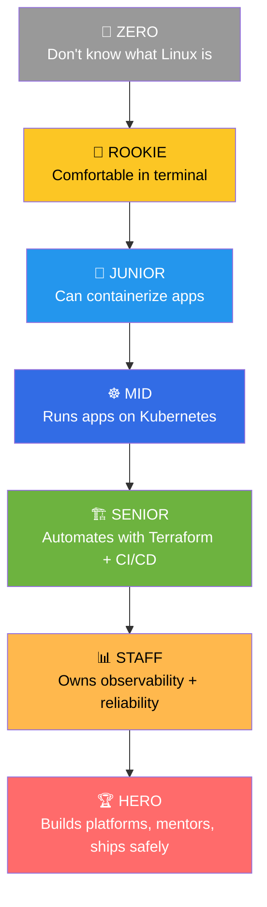

### 🏁 The Hero Checklist

**🐧 Foundations**
- [ ] Comfortable in a Linux terminal without googling basics
- [ ] Can write a bash script with error handling
- [ ] Understand DNS, TCP/IP, HTTP, and TLS
- [ ] Can use Git confidently, including merge conflict resolution

**🐳 Containers**
- [ ] Write an optimized multi-stage Dockerfile
- [ ] Get an image under 100 MB
- [ ] Debug a failing container from logs and shell
- [ ] Run multi-container apps with Compose

**☸️ Kubernetes**
- [ ] Deploy an app with Deployments, Services, Ingress
- [ ] Debug Pending / CrashLoopBackOff / ImagePullBackOff
- [ ] Manage ConfigMaps, Secrets, PVs and PVCs
- [ ] Write and deploy a Helm chart
- [ ] Configure HPA, probes, and resource limits
- [ ] Apply RBAC and NetworkPolicies

**☁️ Cloud**
- [ ] Launch and manage EC2/VMs and networking
- [ ] Deploy to EKS/GKE/AKS
- [ ] Explain IAM roles and least privilege

**🏗️ Automation**
- [ ] Write Terraform for a real VPC + cluster
- [ ] Build a CI/CD pipeline end-to-end
- [ ] Set up GitOps with ArgoCD
- [ ] Manage environments with Kustomize or Helm values

**📊 Reliability**
- [ ] Build a Grafana dashboard from scratch
- [ ] Write a useful, non-noisy alert
- [ ] Define an SLI/SLO and track an error budget
- [ ] Run a blameless postmortem

**🏆 Career**
- [ ] 3+ real projects in a public GitHub
- [ ] Clean READMEs explaining each project
- [ ] Can explain any project for 10 minutes
- [ ] Referred or applied to 20+ roles

---

<div align="center">

# 🚫 Common Mistakes to Avoid

</div>

<div align="center">

| ❌ Mistake | ✅ Do this instead |
| :--- | :--- |
| **Tutorial hell** — watching forever | Build something after every 2 videos |
| Learning 5 clouds at once | Master **one** deeply |
| Learning 20 tools superficially | Go **deep** on Terraform + K8s first |
| Skipping Linux | Linux is the foundation — never skip |
| Not using Git properly | Branch, PR, review — like a real team |
| Ignoring networking | Most outages are networking |
| Copy-pasting without understanding | Type it, break it, fix it |
| Never documenting | Write a README for every project |
| No public proof of work | GitHub + LinkedIn + blog |
| Chasing tools, not fundamentals | Fundamentals outlive every tool |
| Running cloud resources 24/7 | Destroy after practice — watch your bill 💰 |
| Waiting to feel "ready" to apply | Apply at 70% ready, learn the rest on the job |

</div>

---

<div align="center">

# 📚 Learning Resources

</div>

<div align="center">

| Type | Resource |
| :--- | :--- |
| 📖 **Docs** | [kubernetes.io/docs](https://kubernetes.io/docs/), [docs.docker.com](https://docs.docker.com/), [developer.hashicorp.com/terraform](https://developer.hashicorp.com/terraform) |
| 🎓 **Courses** | Kubernetes docs tutorials, KodeKloud, A Cloud Guru, Linux Foundation |
| 🎮 **Practice** | [KodeKloud playgrounds](https://kodekloud.com/), [KillerCoda](https://killercoda.com/), [Play with Docker](https://labs.play-with-docker.com/), [Play with Kubernetes](https://labs.play-with-k8s.com/) |
| 📰 **Newsletters** | DevOps'ish, KubeWeekly, Last Week in AWS |
| 🗺️ **Roadmaps** | [roadmap.sh/devops](https://roadmap.sh/devops) |
| 💬 **Community** | r/devops, r/kubernetes, CNCF Slack, Kubernetes Slack |
| 🎥 **Channels** | TechWorld with Nana, DevOps Toolkit, That DevOps Guy |
| 🧪 **Labs** | Katacoda-style playgrounds, your own minikube |

> 💡 **My #1 advice:** You don't need a course. You need **one hour a day, hands on a keyboard, and a project you actually care about.**

---

<div align="center">

# 🎓 The Golden Rules

</div>

> ### 🥇 Rule 1 — **Learn by breaking things**
> You learn more from one broken cluster than ten tutorials.
>
> ### 🥈 Rule 2 — **Automate the second time**
> Did it manually once? Fine. Twice? Write a script.
>
> ### 🥉 Rule 3 — **If it's not in Git, it doesn't exist**
> Code, docs, infrastructure, configs — all in version control.
>
> ### 🏅 Rule 4 — **Understand before you copy**
> Copy-paste that you can't explain will fail at 3 AM.
>
> ### 🏆 Rule 5 — **Fundamentals beat tools**
> Linux, networking, and problem solving outlive every framework.
>
> ### 💫 Rule 6 — **Tell your story publicly**
> GitHub, blog, LinkedIn. Proof of work beats a résumé line.

---

<div align="center">

## 🎉 You Are Now on the Path


<br/><br/>

### 🔗 Explore the rest of this repo

[](README.md)
[](COMMANDS.md)
[](DEVOPS-0-TO-HERO.md)

<br/>


**⭐ Star this repo and start your DevOps journey today!**

</div>
