<div align="center">

<!-- Animated waving header -->


<!-- Typing animation -->
<a href="https://kubernetes.io">
  
</a>

<br/>

<!-- Badges -->


<br/>

### 📖 Files in this repo

| File | What's inside |
| :--- | :--- |
| 📘 **[README.md](README.md)** | You are here — full Kubernetes notes, easy language |
| ⌨️ **[COMMANDS.md](COMMANDS.md)** | Every `kubectl` command you will ever need |
| 🚀 **[DEVOPS-0-TO-HERO.md](DEVOPS-0-TO-HERO.md)** | Complete DevOps roadmap from zero to hero |
| 🖼️ [kubernetes_architecture.png](kubernetes_architecture.png) | Architecture diagram |
| 📄 [Kubernetes_Architecture_Notes.pdf](Kubernetes_Architecture_Notes.pdf) | Original notes |

</div>

---

<div align="center">

# 🧭 STEP 1 — Understand Kubernetes in 60 Seconds

</div>

> ### 🎯 One-line definition
> **Kubernetes = A robot manager for your containers.**
> You tell it *"I want 3 copies of my app running"* — and it makes sure that is always true, forever. If one crashes, it starts a new one. Automatically. 24/7. Without you.

<details open>
<summary><b>🍕 The perfect real-life example (read this if nothing else)</b></summary>

<br/>

Imagine a **pizza shop chain**.

| Real life | Kubernetes |
| :--- | :--- |
| 👨‍🍳 **Pizza chef** — makes the pizza | 🐳 **Container** — runs your app |
| 🍕 **One pizza box** — chef + recipe + box | 📦 **Pod** — smallest unit, holds your container |
| 👔 **Shop manager** — says "always keep 5 chefs working" | 🎮 **Deployment** — says "always keep 3 Pods running" |
| 🏢 **Shop building** | 🖥️ **Node** — a machine (server) |
| 🧠 **Head office** — decides which shop gets more chefs | 🎛️ **Control Plane** — decides which Node runs your Pod |
| 📞 **Reception desk** — customers call this one number | 🌐 **Service** — one fixed address for all Pods |
| 🗺️ **Menu board outside** — shows customers where to go | 🚪 **Ingress** — routes outside traffic in |
| 💰 **Cash locker** — secret recipe amounts | 🔐 **Secret** — passwords and keys |
| 📋 **Recipe card** — normal instructions | 📝 **ConfigMap** — normal settings |

**That's it.** That is all of Kubernetes, in a pizza shop. 🍕

Everything below is just more detail on those same ideas.

</details>

---

<div align="center">

# 🏗️ STEP 2 — Architecture (The Big Picture)

</div>

## 🧠 Super Simple Explanation

A Kubernetes cluster has **two types of machines**:

```
┌──────────────────────────────────────────────────────────────────┐
│  🧠 THE BOSS (Control Plane / Master Node)                        │
│  "Where should things run? Is everything healthy? Fix it!"        │
└───────────────────────────────┬──────────────────────────────────┘
                                │  gives orders
        ┌───────────────────────┼───────────────────────┐
        ▼                       ▼                       ▼
┌───────────────┐       ┌───────────────┐       ┌───────────────┐
│ 💪 WORKER 1   │       │ 💪 WORKER 2   │       │ 💪 WORKER 3   │
│ Runs your app │       │ Runs your app │       │ Runs your app │
│  [📦][📦][📦] │       │  [📦][📦]     │       │  [📦][📦][📦] │
└───────────────┘       └───────────────┘       └───────────────┘
```

> 🧠 **The Boss decides.** 💪 **The workers do the work.**
> Your app **never** runs on the Boss.

---

## 🧠 2.1 Control Plane — "The Boss"

<!-- Animated flow -->
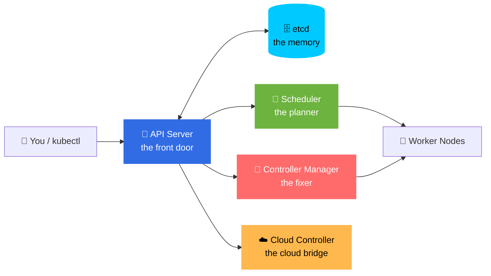

### 🚪 API Server — *the front door of the cluster*

> **Easy definition:** The one and only door to the cluster. Every command, every request, every component goes through here.

- 📥 Receives requests from users (`kubectl`) and from all other components.
- 🔗 Lets Kubernetes components talk to each other.
- 🔐 Checks **authentication** (who are you?), **authorization** (are you allowed?), and **admission control** (is this request valid?).
- 🗄️ **The only component allowed to talk directly to etcd.**

```
kubectl ──┐
kubelet ──┤
schedule ─┼──▶ 🚪 API Server ──▶ 🗄️ etcd
proxy ────┤
You ──────┘
```

---

### 🗄️ etcd — *the cluster's memory/brain database*

> **Easy definition:** A super-secure notebook where Kubernetes writes down **everything** it knows.

- 📝 A **distributed key-value database** — stores cluster state and configuration.
- 🧠 Acts like the **database of Kubernetes** — every object, every change is here.
- 🤝 Distributes copies across nodes; uses **Raft** so all copies agree.
- 🚨 **If etcd dies and you have no backup, your cluster is gone. Back it up!**

---

### 📅 Scheduler — *the placement officer*

> **Easy definition:** The person who decides **which worker machine gets the new Pod**.

- 🔍 Looks at how much CPU and memory is free on each node.
- ✅ Picks the best suitable worker node for the Pod.
- ⚖️ Also respects **taints, tolerations, node affinity, and pod affinity** rules.
- 🧩 Works in 2 steps: **Filter** (which nodes *can* fit?) → **Score** (which fits *best*?).

---

### 🔄 Controller Manager — *the auto-fixer*

> **Easy definition:** The supervisor that keeps checking — *"Is reality the same as what you asked for? No? Then let me fix it."*

- 👀 Watches the whole cluster, 24/7.
- 🎯 Keeps the **actual state = desired state** (this is the famous **reconciliation loop**).
- 🧩 Runs many controllers in one place:
  - **Node Controller** — notices when a node dies.
  - **Replication Controller** — keeps the right number of Pods.
  - **Endpoints Controller** — connects Services to Pods.
  - **ServiceAccount Controller** — creates default identities.
  - **Namespace Controller** — cleans up deleted namespaces.

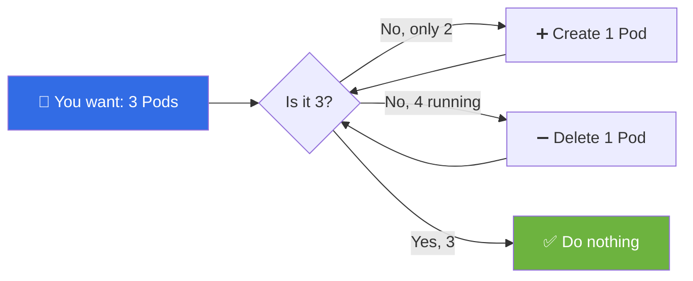

---

### ☁️ Cloud Controller Manager (CCM) — *the cloud translator*

> **Easy definition:** The bridge between Kubernetes and your cloud provider (AWS/GCP/Azure).

- 🌐 Manages **cloud-specific things**: load balancers, storage disks, networking routes.
- 🧼 **Keeps cloud code out of core Kubernetes** — that's why it exists as a separate piece.
- ⚙️ Runs cloud-specific controllers: **node, route, and service controllers**.

---

## 💪 2.2 Worker Node — "The Workers"

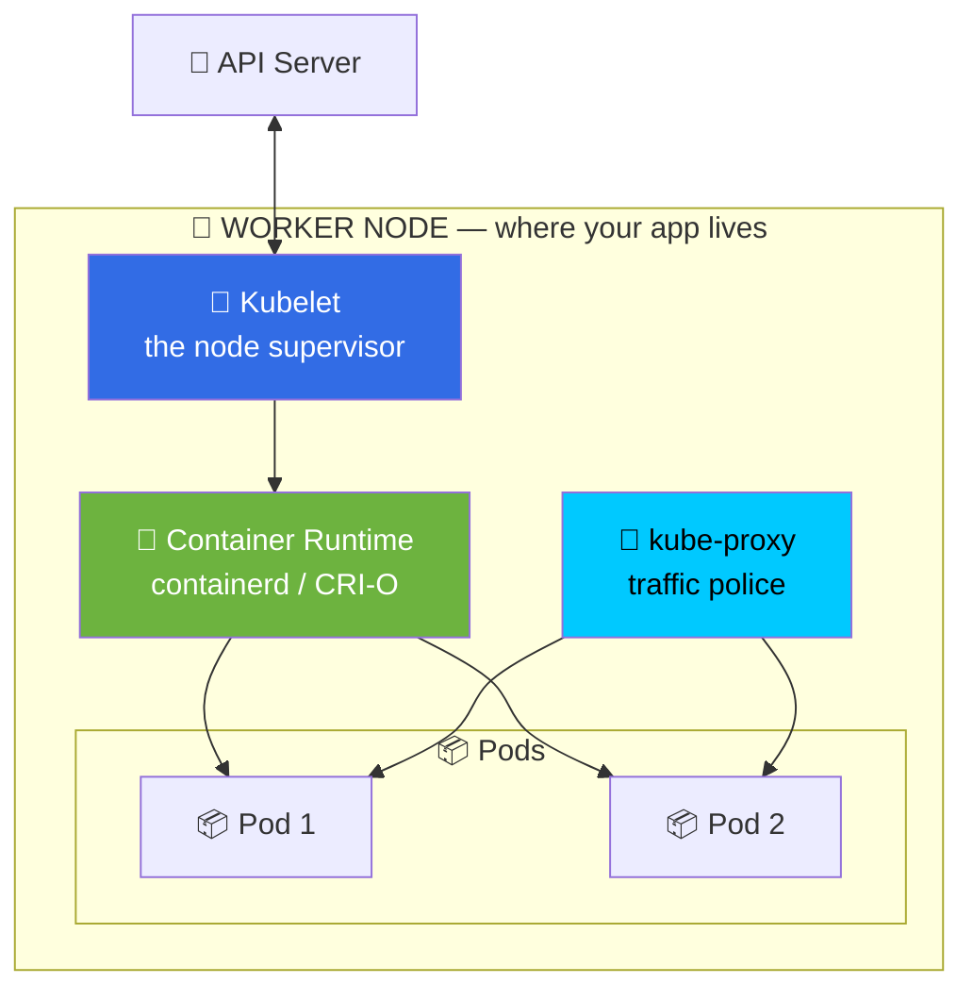

### 👷 Kubelet — *the node supervisor*

> **Easy definition:** A small agent on every worker node that makes sure your Pods are alive.

- 📞 Talks to the **API Server** to get instructions.
- 📦 Manages Pods on its own node.
- 🐳 Tells the **container runtime** to start/stop containers.
- 🩺 Runs health checks and reports node status back.

---

### 🔀 kube-proxy — *the traffic police*

> **Easy definition:** Keeps the rules that send network traffic to the right Pod.

- 📜 Maintains **network rules** (iptables / IPVS / nftables).
- 🎯 Routes traffic to the **correct Pod** behind a Service.
- 🌐 Makes ClusterIP / NodePort / LoadBalancer actually work.

---

### 🐳 Container Runtime — *the container engine*

> **Easy definition:** The actual software that starts and stops containers.

- ✅ Examples: **containerd**, **CRI-O**
- ⚠️ **Docker was used earlier, but Kubernetes removed direct Docker support (`dockershim`) from v1.24 onward.**
- 🔌 Runtimes follow a standard called **CRI** (Container Runtime Interface) — so Kubernetes can swap them freely.
- 💡 *You can still build images with Docker — you just can't use Docker Engine as the runtime.*

---

### 📦 Pods — *the smallest unit*

> **Easy definition:** A box that holds one or more containers that live together and share everything.

- Smallest thing Kubernetes can create and manage.
- Containers in a Pod **share the same IP and ports**, and can share storage.
- 💡 Usually **1 pod = 1 container**.

---

## 📋 2.3 Revision Tables (Memorize These!)

<div align="center">

### 🧠 Master / Control Plane

| Component | Icon | Remember it as | One-line job |
| :--- | :---: | :--- | :--- |
| **API Server** | 🚪 | **Communication** | The only front door |
| **etcd** | 🗄️ | **Stores cluster data** | The cluster's memory |
| **Scheduler** | 📅 | **Selects worker node** | Decides where Pods go |
| **Controller Manager** | 🔄 | **Maintains desired state** | Auto-fixes drift |
| **Cloud Controller Manager** | ☁️ | **Connects to cloud** | Talks to AWS/GCP/Azure |

### 💪 Worker Node

| Component | Icon | Remember it as | One-line job |
| :--- | :---: | :--- | :--- |
| **Kubelet** | 👷 | **Runs and monitors Pods** | Node supervisor |
| **kube-proxy** | 🔀 | **Network rules** | Routes Service traffic |
| **Container Runtime** | 🐳 | **Runs containers** | containerd / CRI-O |
| **Pod** | 📦 | **Smallest unit** | Holds your containers |

</div>

> ### 🧠 10-second memory trick
> **BoSS-F**: **B**oss = **A**PI, **e**tcd, **S**cheduler, **S**elf-healer (Controller), **F**ixer of cloud (CCM)
> **SKCR**: **S**upervisor (kubelet), **K**eeper of rules (proxy), **C**ontainer runtime, **R**un unit (Pod)

---

<div align="center">

# 📦 STEP 3 — Core Objects (The LEGO Blocks)

</div>

> **Easy definition:** Kubernetes objects are things you *describe in YAML*. You describe, Kubernetes builds. That's the deal.

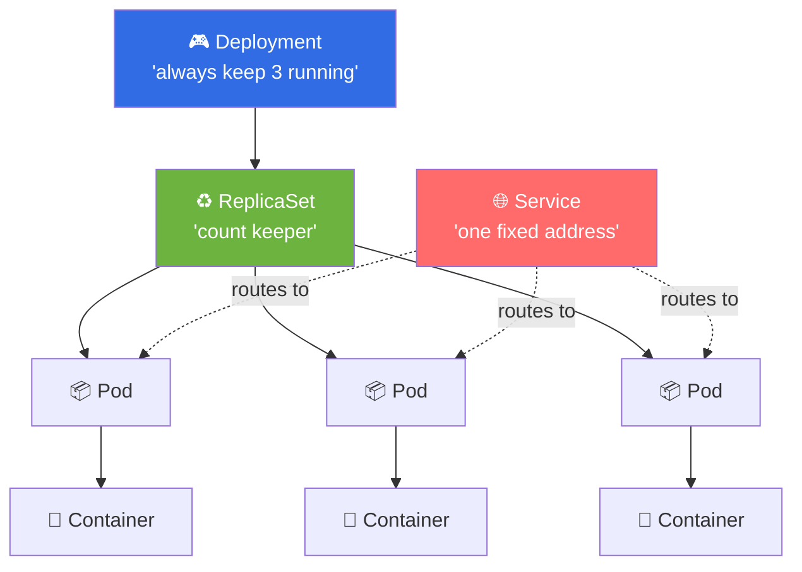

<div align="center">

| Object | Emoji | 🧒 Easy definition | Real-world analogy |
| :--- | :---: | :--- | :--- |
| **Pod** | 📦 | Smallest runnable unit | One tiffin box |
| **ReplicaSet** | ♻️ | Keeps a fixed count of Pods | Counter that refills a tray |
| **Deployment** | 🎮 | Manages ReplicaSets + updates | Manager who hires & upgrades |
| **StatefulSet** | 🔢 | Pods with permanent names & storage | Numbered lockers, same owner |
| **DaemonSet** | 🛡️ | One Pod on *every* node | CCTV camera on every floor |
| **Job** | ✅ | Runs a task until finished | One-time exam |
| **CronJob** | ⏰ | Runs a Job on a schedule | Daily alarm clock |
| **Service** | 🌐 | One fixed address for many Pods | Company reception number |
| **Ingress** | 🚪 | Routes outside traffic in | Building's main gate + map |
| **ConfigMap** | 📝 | Normal settings | Recipe card |
| **Secret** | 🔐 | Passwords and keys | Cash locker |
| **PV / PVC** | 💾 | Real storage / request for storage | Warehouse / order form |
| **Namespace** | 🗂️ | Logical folders inside a cluster | Folders in a cabinet |
| **ServiceAccount** | 🪪 | ID card for a Pod | Employee ID badge |

</div>

---

## 📦 3.1 Pod — In Depth

> **Easy definition:** A Pod is a wrapper around your container(s). It's the smallest thing Kubernetes can create, move, or delete.

**Why not just run a container?**
Because sometimes two containers need to be *best friends*:

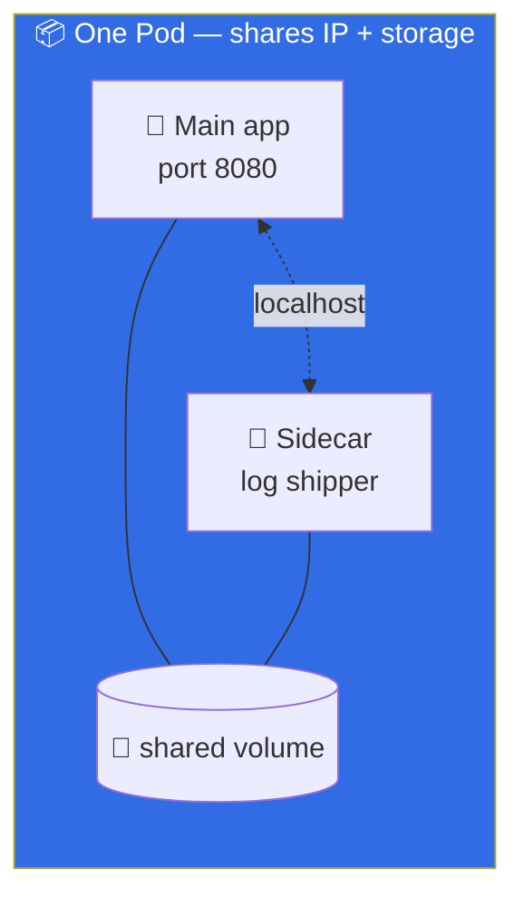

**Pod patterns:**

| Pattern | 🧒 Easy definition |
| :--- | :--- |
| **Sidecar** | Helper container that assists the main one (logs, proxy) |
| **Init container** | Runs and *finishes* before the main app starts |
| **Ambassador** | Proxy that connects the app to the outside world |
| **Adapter** | Converts the app's output into a standard format |
| **Ephemeral** | A temporary debug container you inject into a live Pod |

**Pod lifecycle — the 5 states:**

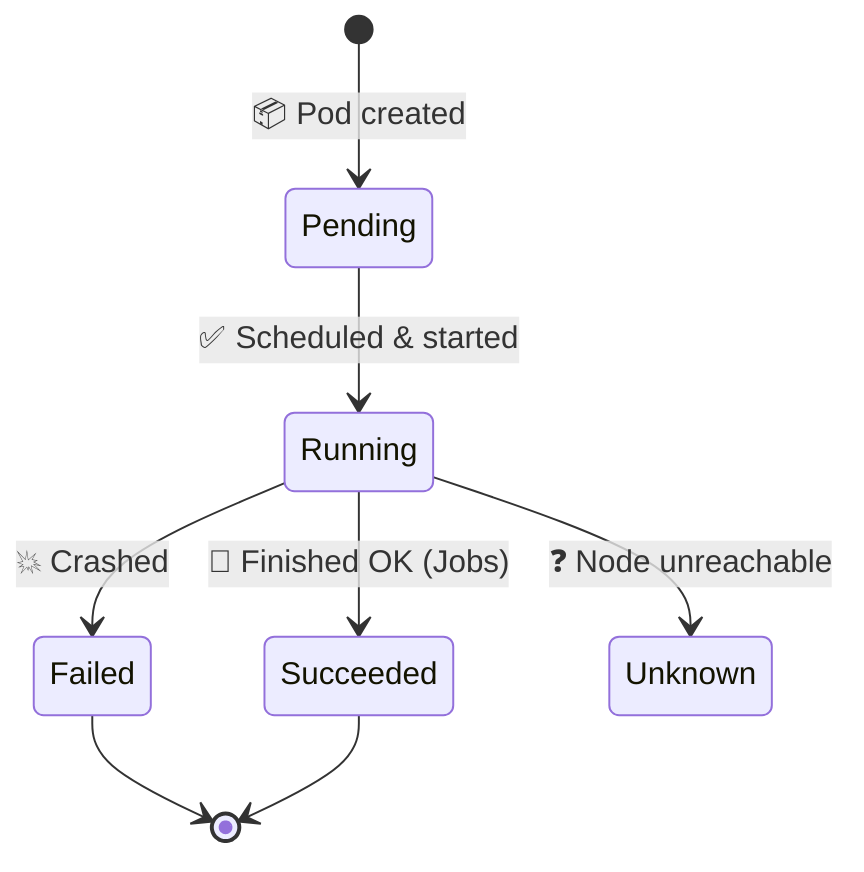

> ⚠️ **Never create bare Pods in production.** A bare Pod is *not* recreated if its node dies. Always use a **Deployment**.

---

## ♻️ 3.2 ReplicaSet

> **Easy definition:** A babysitter that counts Pods. If count is too low, it creates. Too high, it deletes.

- Uses **label selectors** to know which Pods belong to it.
- You rarely write one directly — **Deployments create them for you**.
- 💡 Interview favourite: *"Do you ever create ReplicaSets manually?"* → Almost never.

---

## 🎮 3.3 Deployment — *the most used object*

> **Easy definition:** A manager for ReplicaSets. It gives you **rolling updates** and **rollbacks** with zero downtime.

**Features:**

| Feature | 🧒 Easy definition |
| :--- | :--- |
| **Rolling Update** | Replace Pods one by one — no downtime |
| **Recreate** | Kill all, then start all — downtime (dev only) |
| **Rollback** | Undo the last update instantly |
| **Scaling** | Change `replicas` and it just happens |
| **History** | Keeps old versions so you can go back |

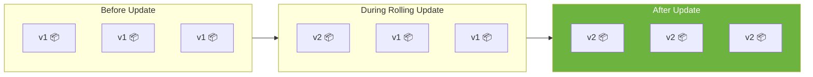

**Strategy settings:**

```yaml
strategy:
  type: RollingUpdate
  rollingUpdate:
    maxSurge: 1          # how many EXTRA pods allowed during update
    maxUnavailable: 0    # how many pods can be DOWN (0 = zero downtime)
```

> 💡 **Zero-downtime deploy recipe:** `maxUnavailable: 0` + `maxSurge: 1` + good **readiness probes**.

---

## 🔢 3.4 StatefulSet — *for databases*

> **Easy definition:** Like a Deployment, but the Pods get **permanent names** and their **own storage** that follows them.

| Deployment | StatefulSet |
| :--- | :--- |
| Pods named `web-a1b2c3` (random) | Pods named `db-0`, `db-1`, `db-2` (ordered) |
| All Pods share storage | Each Pod has **its own** storage |
| Start in any order | Start **one by one**, in order |
| For stateless apps | For **databases, Kafka, Elasticsearch** |

**Needs a "headless Service"** — a Service with `clusterIP: None` that gives each Pod its own DNS name.

---

## 🛡️ 3.5 DaemonSet

> **Easy definition:** Runs **one copy of a Pod on every node**. Automatically, including new nodes you add later.

**Used for:**
- 📊 Monitoring agents (node-exporter)
- 📜 Log collectors (Fluentd, Fluent Bit)
- 🌐 Networking (CNI plugins)
- 💾 Storage daemons

> 🧒 **Analogy:** Like putting a CCTV camera on every floor of a building. Add a new floor → camera appears automatically.

---

## ✅ 3.6 Job & ⏰ 3.7 CronJob

| | Job | CronJob |
| :--- | :--- | :--- |
| **🧒 Easy def** | Runs Pods until they **complete successfully** | Creates Jobs **on a schedule** |
| **Analogy** | One-time exam | Daily alarm ⏰ |
| **Use case** | DB migration, batch processing | Nightly backup, report generation |
| **Key fields** | `completions`, `parallelism`, `backoffLimit` | `schedule`, `concurrencyPolicy` |

**Cron format** (same as Linux cron):

```
┌───────── minute (0-59)
│ ┌─────── hour (0-23)
│ │ ┌───── day of month (1-31)
│ │ │ ┌─── month (1-12)
│ │ │ │ ┌─ day of week (0-6, Sun=0)
│ │ │ │ │
* * * * *
```

| Schedule | Meaning |
| :--- | :--- |
| `0 2 * * *` | Every day at 2:00 AM |
| `*/5 * * * *` | Every 5 minutes |
| `0 0 * * 0` | Every Sunday at midnight |
| `0 9 * * 1-5` | Weekdays at 9:00 AM |

---

<div align="center">

# 🏷️ STEP 4 — Labels, Selectors & Annotations

</div>

> **Easy definition:** Labels are **name tags** you stick on objects so you can find and group them.

<div align="center">

| Concept | 🧒 Easy definition | Analogy |
| :--- | :--- | :--- |
| **Label** | A name tag (`app: web`) | Sticky note on a box |
| **Selector** | A way to search by tags | "Find all red boxes" |
| **Annotation** | Extra notes for tools | Margin comments in a book |

</div>

**Labels are how everything connects:**

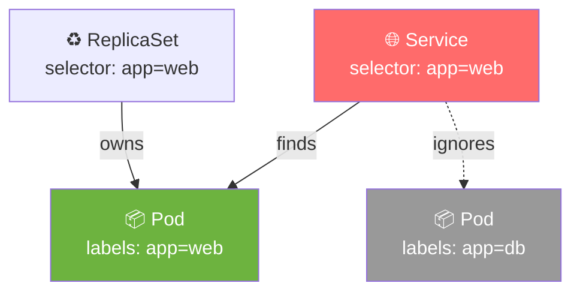

**Selector types:**

```yaml
# Equality based
selector: { app: web, env: prod }

# Set based
selector:
  matchExpressions:
    - { key: env, operator: In, values: [prod, staging] }
    - { key: tier, operator: NotIn, values: [db] }
```

> 💡 **Pro tip:** Use the **recommended labels** so tools work automatically:
> `app.kubernetes.io/name`, `app.kubernetes.io/version`, `app.kubernetes.io/component`, `app.kubernetes.io/part-of`, `app.kubernetes.io/managed-by`

---

<div align="center">

# 🗂️ STEP 5 — Namespaces

</div>

> **Easy definition:** Folders inside your cluster to keep things organized and separate.

<div align="center">

| Namespace | 🧒 What it's for |
| :--- | :--- |
| `default` | Where your stuff goes if you don't say otherwise |
| `kube-system` | Kubernetes' own system Pods (don't touch!) |
| `kube-public` | Publicly readable cluster info |
| `kube-node-lease` | Node heartbeats |

</div>

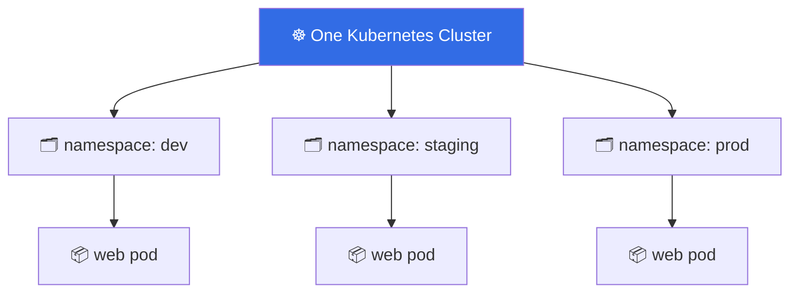

**Key facts:**

| Fact | Detail |
| :--- | :--- |
| Name uniqueness | Names are unique **inside a namespace**, not cluster-wide |
| Cluster-scoped objects | **Nodes, PVs, StorageClasses, ClusterRoles** are NOT namespaced |
| DNS format | `<service>.<namespace>.svc.cluster.local` |
| Example | Service `web` in namespace `dev` → `web.dev.svc.cluster.local` |
| Multi-tenancy | Use **ResourceQuota** + **LimitRange** per namespace |

---

<div align="center">

# 🌐 STEP 6 — Networking

</div>

> ### 🧒 The 3 Golden Rules of Kubernetes Networking
> 1. **Every Pod gets its own IP address.**
> 2. **Every Pod can talk to every other Pod directly — no NAT.**
> 3. **Every Node can reach every Pod directly.**

This flat network is built by a **CNI plugin**: `Calico`, `Cilium`, `Flannel`, `Weave Net`, `Antrea`, `AWS VPC CNI`.

---

## 🌐 6.1 Services — *the fixed address*

> **Easy definition:** Pods come and go (they get new IPs). A Service gives them **one permanent address** that never changes.

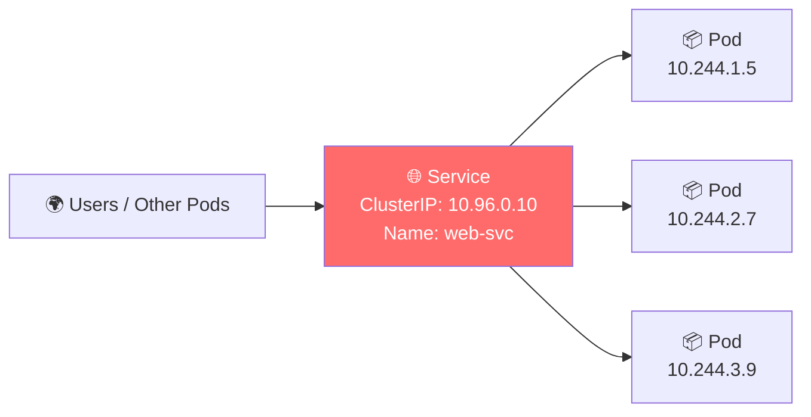

<div align="center">

### 🎭 The 5 Service Types

| Type | 🧒 Easy definition | When to use |
| :--- | :--- | :--- |
| **ClusterIP** ⭐ | Only reachable **inside** the cluster | Pod-to-Pod (default, most common) |
| **NodePort** | Opens a port on **every node** | Dev / testing |
| **LoadBalancer** | Cloud gives you a **public IP** | Production external traffic |
| **ExternalName** | Just a **nickname** for an outside website | Point to a DB outside the cluster |
| **Headless** | No IP — returns Pod IPs directly | StatefulSets, direct Pod access |

</div>

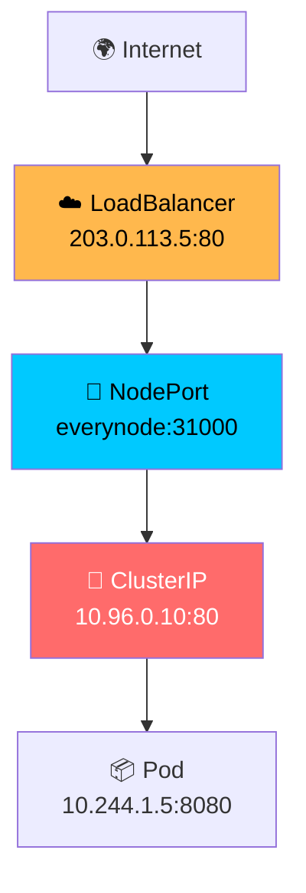

**The 3 ports you must never confuse:**

```yaml
ports:
  - port: 80          # 🎯 Service's own port (others call this)
    targetPort: 8080  # 🐳 Container's port (app listens here)
    nodePort: 31000   # 🔌 Port on each Node (30000-32767)
```

> 🧠 **Memory trick:** **nodePort → targetPort** outside-in. Like address → building → apartment.

---

## 🚪 6.2 Ingress — *the smart front gate*

> **Easy definition:** One entry point that routes traffic to different Services based on the **URL or domain name**.

**Without Ingress:** you need a LoadBalancer per app (expensive 💸)
**With Ingress:** one LoadBalancer for many apps (cheap ✅)

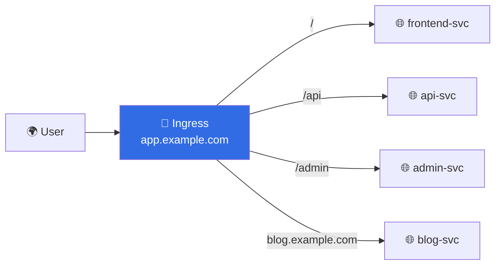

**Needs an Ingress Controller** (it's not built-in!): NGINX, Traefik, HAProxy, Contour, or your cloud's controller.

| Feature | Meaning |
| :--- | :--- |
| **Path routing** | `/api` → api service, `/` → frontend |
| **Host routing** | `blog.example.com` → blog service |
| **TLS** | HTTPS certificates via a Secret |

---

## 🛡️ 6.3 NetworkPolicy — *the Pod firewall*

> **Easy definition:** By default, all Pods can talk to all Pods. A NetworkPolicy **blocks** that.

- 🔒 Selects Pods by labels, then defines what **ingress** (incoming) and **egress** (outgoing) is allowed.
- ⚠️ **Requires a CNI that enforces it** — Calico and Cilium do; plain Flannel does not.
- ✅ Best practice: **default deny all**, then open only what you need.

```yaml
apiVersion: networking.k8s.io/v1
kind: NetworkPolicy
metadata:
  name: deny-all
spec:
  podSelector: {}      # applies to ALL pods
  policyTypes: ["Ingress", "Egress"]
```

---

## 📞 6.4 DNS — *the phonebook*

> **Easy definition:** Every Service automatically gets a name, so you never hardcode IPs.

| Type | Format | Example |
| :--- | :--- | :--- |
| Service | `<svc>.<ns>.svc.cluster.local` | `web.dev.svc.cluster.local` |
| Pod | `<ip-dashed>.<ns>.pod.cluster.local` | `10-244-1-5.default.pod.cluster.local` |

- Runs as **CoreDNS** in the `kube-system` namespace.
- Short names work *within the same namespace*: just `web`.

---

<div align="center">

# 📝 SETUP — Configuration & Secrets

</div>

> **Easy definition:** Keep your settings **out of your container image**, so the same image works in dev, staging, and prod.

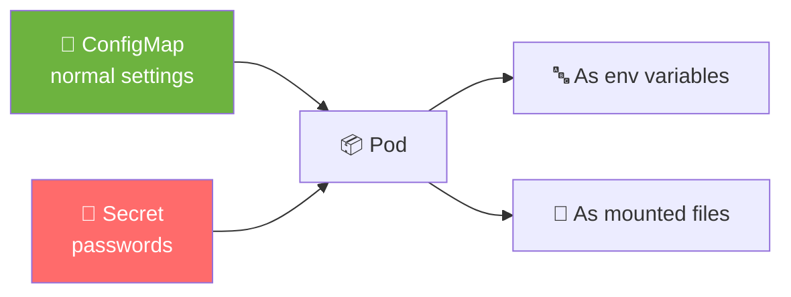

<div align="center">

| | 📝 ConfigMap | 🔐 Secret |
| :--- | :--- | :--- |
| **🧒 Easy def** | Normal, non-secret settings | Passwords, tokens, keys |
| **Storage** | Plain text | **base64 encoded** (NOT encrypted!) |
| **Examples** | `LOG_LEVEL=info`, config files | DB password, API key, TLS cert |
| **Analogy** | Recipe card 📋 | Cash locker 💰 |

</div>

> ⚠️ **Critical truth:** base64 is **encoding, not encryption**. Anyone with read access can decode it. For real security use:
> **Encryption at rest** + **RBAC** + **External Secrets Operator / Sealed Secrets / Vault**

**3 ways to use them:**

```yaml
# 1️⃣ As environment variables
envFrom:
  - configMapRef: { name: app-config }
env:
  - name: DB_PASSWORD
    valueFrom:
      secretKeyRef: { name: db-secret, key: password }

# 2️⃣ As mounted files
volumeMounts:
  - { name: cfg, mountPath: /etc/config }

# 3️⃣ As command-line arguments
command: ["app", "--config=/etc/config/app.yaml"]
```

> 💡 **Gotcha:** Mounted ConfigMaps/Secrets update automatically (~1 min). **Environment variables do NOT** — you need a Pod restart.

---

<div align="center">

# 💾 STEP 8 — Storage

</div>

> **Easy definition:** Containers are temporary — if a container dies, its files vanish. Storage keeps data alive.

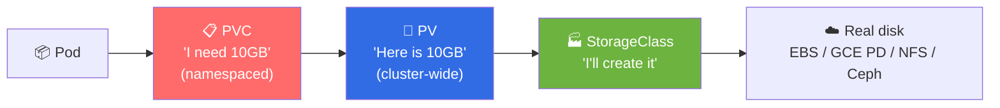

<div align="center">

| Object | 🧒 Easy definition | Analogy |
| :--- | :--- | :--- |
| **Volume** | Storage that lives and dies with the Pod | Disposable cup |
| **PV** | A real piece of storage in the cluster | A warehouse |
| **PVC** | Your *request* for storage | Order form |
| **StorageClass** | Instructions for *how* to create storage | Factory blueprint |
| **CSI** | The standard "plug" for storage vendors | Universal adapter |

</div>

### 🔑 Access Modes

| Mode | Short | Meaning |
| :--- | :---: | :--- |
| ReadWriteOnce | **RWO** | One node can read+write |
| ReadOnlyMany | **ROX** | Many nodes, read only |
| ReadWriteMany | **RWX** | Many nodes, read+write |
| ReadWriteOncePod | **RWOP** | One single Pod, read+write |

### 🗑️ Reclaim Policies — *what happens when you delete the PVC?*

| Policy | Meaning |
| :--- | :--- |
| `Retain` | Keep the data safe (manual cleanup) |
| `Delete` | Delete the real disk too |
| `Recycle` | Deprecated |

### 📂 Common Volume Types

| Type | 🧒 Easy definition |
| :--- | :--- |
| `emptyDir` | Scratch space, deleted with the Pod |
| `hostPath` | Mounts a node's folder ⚠️ security risk |
| `configMap` / `secret` | Inject settings as files |
| `csi` | Any modern storage (cloud disks, NFS, Ceph) |

> 💡 **Dynamic provisioning magic:** If your PVC names a StorageClass, Kubernetes creates the PV **automatically**. No manual PV needed!

---

<div align="center">

# 📅 STEP 9 — Scheduling (Who Goes Where?)

</div>

> **Easy definition:** The Scheduler is a matchmaker — it finds the best node for each Pod.

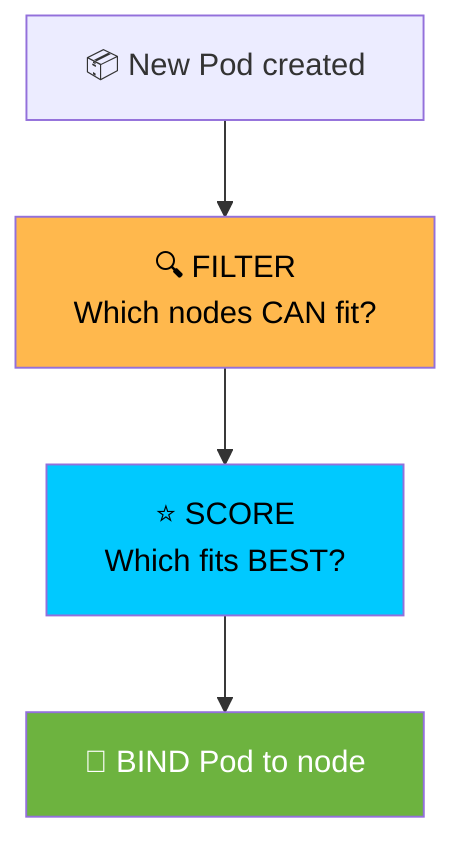

## 📊 Requests vs Limits

> **Easy definition:**
> **Request** = *"I need at least this much"* → used for **placing** the Pod.
> **Limit** = *"I'm not allowed more than this"* → used for **stopping** the Pod.

```yaml
resources:
  requests: { cpu: "250m", memory: "128Mi" }   # guaranteed minimum
  limits:   { cpu: "500m", memory: "256Mi" }   # hard ceiling
```

| If it exceeds... | What happens |
| :--- | :--- |
| **Memory limit** 💥 | Pod is **OOMKilled** (killed instantly) |
| **CPU limit** 🐌 | Pod is **throttled** (slowed down, not killed) |

> 🧠 `250m` = 0.25 CPU = ¼ of one core. `1000m` = 1 full core.

## 🎯 The Scheduling Toolbox

<div align="center">

| Tool | 🧒 Easy definition |
| :--- | :--- |
| **nodeSelector** | Simplest: "run only on nodes with this label" |
| **Node Affinity** | Fancy nodeSelector with required/preferred rules |
| **Pod Affinity** | "Put me *next to* Pods that look like X" |
| **Pod Anti-Affinity** | "Keep me *away from* Pods that look like X" |
| **Taints** | A node says "stay away unless you're special" |
| **Tolerations** | A Pod says "I'm allowed on that tainted node" |
| **Topology Spread** | "Spread my Pods evenly across zones" |
| **Priority / Preemption** | "Important Pods can kick out less important ones" |

</div>

## 🚫 Taints & Tolerations Explained Simply

> 🧒 **Analogy:** A node with a taint is a **VIP-only club** 🎩. Only Pods carrying a **tolerance** (a VIP pass) get in.

```
Node says:   "taint: gpu=true:NoSchedule"   → 🚫 normal Pods can't enter
Pod says:    "toleration: gpu=true"         → 🎫 VIP pass, come on in!
```

**Taint effects:**

| Effect | Meaning |
| :--- | :--- |
| `NoSchedule` | New Pods won't be placed here |
| `PreferNoSchedule` | Try to avoid, but allow if needed |
| `NoExecute` | **Evict** existing Pods that don't tolerate it |

> 💡 **Real example:** Control plane nodes carry `node-role.kubernetes.io/control-plane:NoSchedule` so your apps never land on them.

---

<div align="center">

# 📈 STEP 10 — Scaling & Autoscaling

</div>

> **Easy definition:** Autoscaling = your cluster automatically grows and shrinks based on demand.

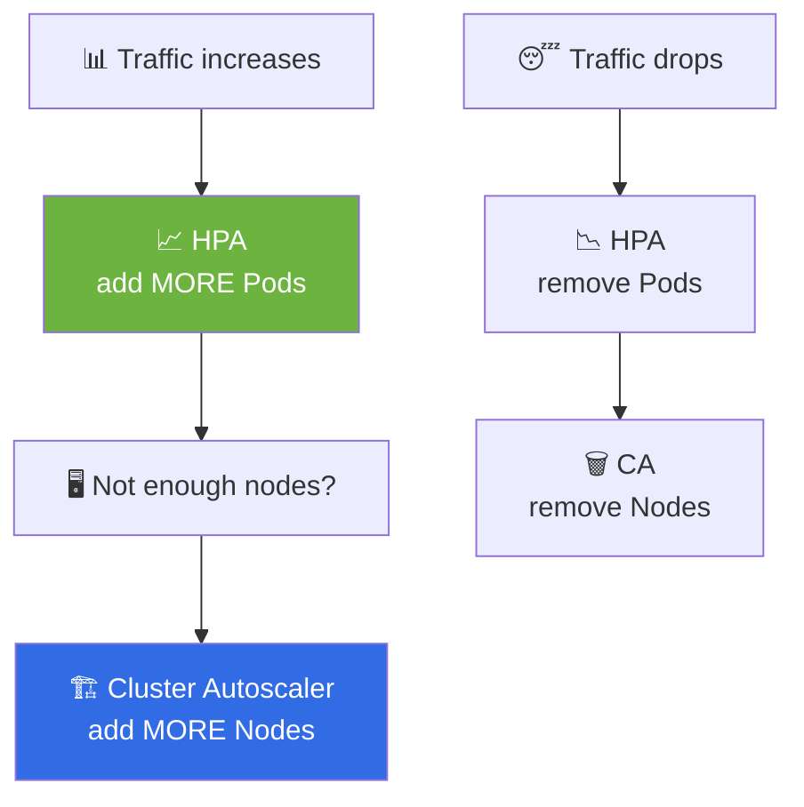

<div align="center">

| Autoscaler | What it scales | Emoji |
| :--- | :--- | :---: |
| **HPA** — Horizontal Pod Autoscaler | Number of **Pod replicas** | 📈 |
| **VPA** — Vertical Pod Autoscaler | CPU/memory **requests & limits** | 📏 |
| **CA** — Cluster Autoscaler | Number of **Nodes** | 🏗️ |
| **KEDA** | Pods based on **events** (queue length, Kafka lag) | ⚡ |

</div>

**HPA in plain English:**

> *"If average CPU goes above 70%, add Pods. If it drops, remove them. Never go below 2 or above 10."*

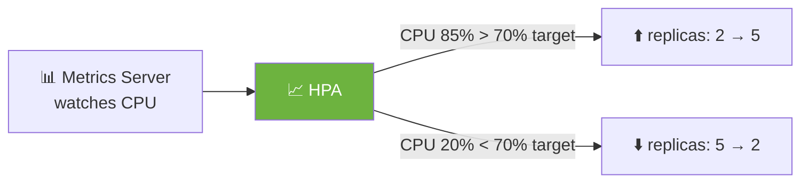

> ⚠️ **HPA needs 2 things to work:** (1) **resource requests** set on the Pods, and (2) the **Metrics Server** installed.

## 🛡️ PodDisruptionBudget (PDB)

> **Easy definition:** A rule that says *"you may never take down more than X of my Pods at once"* — protects you during node maintenance.

```yaml
apiVersion: policy/v1
kind: PodDisruptionBudget
metadata: { name: web-pdb }
spec:
  minAvailable: 2          # always keep at least 2 alive
  selector: { matchLabels: { app: web } }
```

---

<div align="center">

# 🩺 STEP 11 — Health Checks (Probes)

</div>

> **Easy definition:** Kubernetes constantly asks your app *"Are you alive? Are you ready?"* using three different questions.

<div align="center">

| Probe | ❓ Question it asks | 💥 What happens on failure |
| :--- | :--- | :--- |
| **Liveness** 💓 | "Are you still alive?" | Container is **restarted** |
| **Readiness** ✅ | "Can you serve traffic yet?" | Removed from Service (no traffic) |
| **Startup** 🚀 | "Have you finished starting up?" | Other probes wait; restart if too slow |

</div>

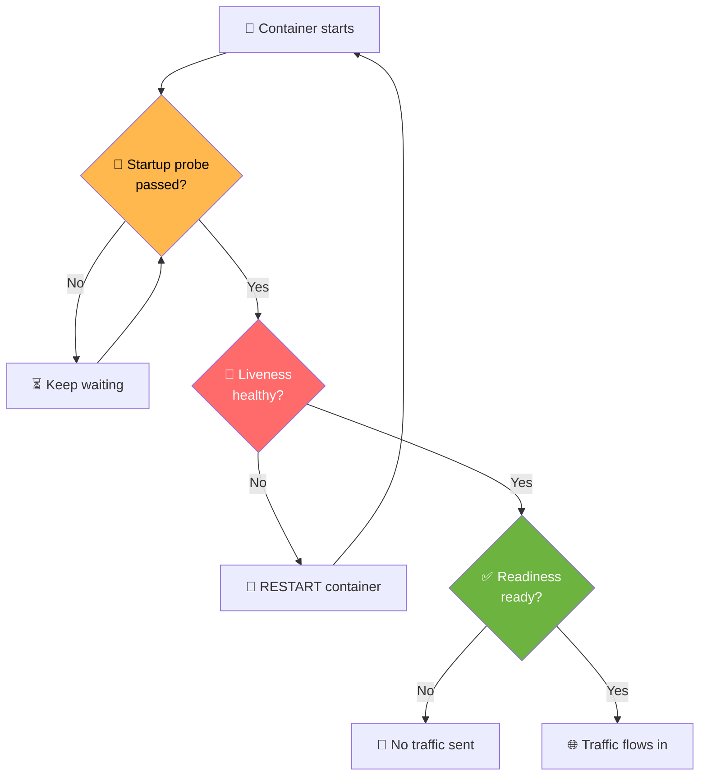

**Probe types:**

| Type | Use for |
| :--- | :--- |
| `httpGet` | Web apps (checks an HTTP endpoint) |
| `tcpSocket` | Anything with a port (DBs, queues) |
| `exec` | Runs a command inside the container |
| `grpc` | gRPC services |

> ⚠️ **Classic mistake:** Aggressive liveness probes cause **CrashLoopBackOff**. For slow apps, use a **startupProbe** first, then liveness.

---

<div align="center">

# 🔐 STEP 12 — Security & RBAC

</div>

> ### 🧒 Easy definition of RBAC
> **RBAC = Who can do What, Where.**
> *"Alice can read Pods in the dev namespace"* — that's RBAC.

<div align="center">

| Object | 🧒 Easy definition | Scope |
| :--- | :--- | :--- |
| **Role** | A list of permissions | One namespace |
| **ClusterRole** | Same, but cluster-wide | Whole cluster |
| **RoleBinding** | Gives a Role to a person/service | One namespace |
| **ClusterRoleBinding** | Gives a ClusterRole cluster-wide | Whole cluster |
| **ServiceAccount** | An **ID card for a Pod** | One namespace |

</div>

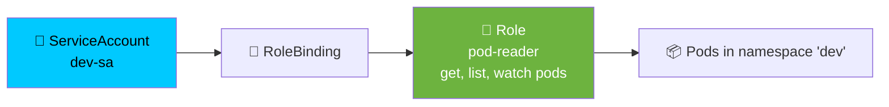

> 🧠 **Memory trick:** **Role = the rules. Binding = who gets the rules.**

## 👮 Simple RBAC Example

| Subject | Role | Namespace | Result |
| :--- | :--- | :--- | :--- |
| `dev-sa` | `pod-reader` | `dev` | Can read Pods in `dev` only |
| `dev-sa` | `pod-reader` | `prod` | ❌ Nothing (wrong namespace) |
| `admin` | `cluster-admin` | all | Can do everything ⚠️ |

## 🏰 The 4 Cs of Cloud Native Security


> Secure each layer from the outside in. A weak cloud is a weak everything.

## 🛡️ Hardening Checklist

| Area | What to do |
| :--- | :--- |
| **Container** | `runAsNonRoot: true`, `readOnlyRootFilesystem: true`, drop all capabilities |
| **Pod Security** | Use Pod Security Admission levels: `privileged`, `baseline`, `restricted` |
| **Network** | Default-deny NetworkPolicy |
| **Secrets** | Encrypt at rest; use Vault / Sealed Secrets / External Secrets |
| **RBAC** | Least privilege; avoid `cluster-admin` |
| **Images** | Scan (Trivy), sign (Cosign), pin versions |
| **Cluster** | Keep patched; enable audit logging |
| **Nodes** | Avoid `hostPath`, `hostNetwork`, `privileged: true` |

## 🏅 Pod Security Admission Levels

| Level | 🧒 Easy definition |
| :--- | :--- |
| `privileged` | No restrictions (dangerous) |
| `baseline` | Blocks known bad things |
| `restricted` | Strictly hardened (best practice) |

```bash
kubectl label namespace prod pod-security.kubernetes.io/enforce=restricted
```

---

<div align="center">

# ⚖️ STEP 13 — Resource Management (QoS)

</div>

> **Easy definition:** Kubernetes puts your Pod in one of 3 "quality classes" based on whether you set requests and limits. Better class = safer from eviction.

```mermaid
graph TB
    A{"Did you set requests<br/>AND limits?"}
    A -- "Yes, and they're EQUAL" --> G["🥇 Guaranteed<br/>Evicted LAST"]
    A -- "Yes, but different" --> B["🥈 Burstable<br/>Evicted MIDDLE"]
    A -- "No / partially" --> BE["🥉 BestEffort<br/>Evicted FIRST"]

    style G fill:#6DB33F,color:#fff
    style B fill:#FFB84D,color:#000
    style BE fill:#FF6B6B,color:#fff
```

<div align="center">

| QoS Class | Condition | Eviction order |
| :--- | :--- | :---: |
| 🥇 **Guaranteed** | requests **==** limits for all containers | Last |
| 🥈 **Burstable** | requests < limits | Middle |
| 🥉 **BestEffort** | No requests or limits at all | First |

</div>

## 📦 ResourceQuota & LimitRange

| Object | 🧒 Easy definition | Scope |
| :--- | :--- | :--- |
| **ResourceQuota** | "This namespace can use at most 10 CPUs total" | Namespace |
| **LimitRange** | "Every new container gets these defaults" | Namespace |

> 💡 **Why use them?** Without quotas, one team can accidentally eat the whole cluster.

---

<div align="center">

# 📦 STEP 14 — Helm (The Package Manager)

</div>

> **Easy definition:** Helm = **App Store for Kubernetes**. Instead of writing 20 YAML files, you install a ready-made **Chart**.

```mermaid
graph LR
    A["📦 Helm Chart<br/>templates + values"] --> B["🔧 helm install"]
    B --> C["⚙️ Kubernetes<br/>objects created"]
    D["📝 values.yaml"] --> B

    style A fill:#0F1689,color:#fff
    style B fill:#326CE5,color:#fff
```

**Chart structure:**

```
mychart/
├── Chart.yaml          # 📋 metadata (name, version)
├── values.yaml         # ⚙️ default settings
└── templates/          # 📄 templated YAML
    ├── deployment.yaml
    └── service.yaml
```

| Concept | 🧒 Easy definition |
| :--- | :--- |
| **Chart** | A package of Kubernetes YAML |
| **Release** | One *installed* chart instance |
| **Values** | Settings you can override |
| **Repository** | A collection of charts |

> 🧠 **Helm vs kubectl:** `kubectl` = apply one file. `helm` = install a whole app with all its parts, versions, and rollback.

---

<div align="center">

# 🧰 STEP 15 — The Ecosystem (Know These Names)

</div>

<div align="center">

| Category | Tools |
| :--- | :--- |
| 🚀 **GitOps** | Argo CD, Flux |
| 📊 **Monitoring** | Prometheus, Grafana, Loki, OpenTelemetry |
| 🕸️ **Service Mesh** | Istio, Linkerd, Cilium |
| 👮 **Policy** | OPA Gatekeeper, Kyverno |
| 💾 **Backup** | Velero |
| 🔐 **Secrets** | External Secrets, Sealed Secrets, Vault |
| 🎢 **Progressive Delivery** | Argo Rollouts, Flagger |
| 📜 **Certificates** | cert-manager |
| ⚡ **Autoscaling** | KEDA, Karpenter |
| 🏗️ **Distributions** | k3s, kind, minikube, Rancher, OpenShift, Talos |

</div>

---

<div align="center">

# 🚀 STEP 16 — Getting Started (Hands-On)

</div>

## 🏠 Local Cluster Options

<div align="center">

| Tool | 🧒 Easy definition | Best for |
| :--- | :--- | :--- |
| **minikube** | A whole K8s in one VM/container | Learning |
| **kind** | Kubernetes IN Docker | CI/CD testing |
| **k3d** | k3s in Docker — super fast | Quick experiments |
| **Docker Desktop** | Built-in cluster toggle | Easiest start |

</div>

```bash
# 🚀 Fastest path to a running cluster
minikube start --cpus=4 --memory=8g
kubectl get nodes
```

## ☁️ Production Options

| Option | 🧒 Easy definition |
| :--- | :--- |
| **kubeadm** | Official tool — you manage everything |
| **EKS / GKE / AKS** | Cloud runs the control plane for you |
| **Rancher / OpenShift** | Full platforms on top of K8s |
| **Cluster API** | Create clusters using YAML |

## 🔄 The Upgrade Order (Never Skip Minor Versions!)

```mermaid
graph LR
    A["1️⃣ Upgrade<br/>Control Plane"] --> B["2️⃣ Upgrade<br/>Worker Nodes<br/>drain→upgrade→uncordon"]
    B --> C["3️⃣ Upgrade<br/>Add-ons + CNI"]

    style A fill:#326CE5,color:#fff
    style B fill:#6DB33F,color:#fff
    style C fill:#FFB84D,color:#000
```

---

<div align="center">

# 🐛 STEP 17 — Troubleshooting (The Detective Work)

</div>

> ### 🔍 The Universal Debug Flow — memorize this!

```mermaid
graph TB
    A["1️⃣ kubectl get pods<br/>What's the status?"] --> B["2️⃣ kubectl describe pod<br/>Read the Events at the bottom ⬇️"]
    B --> C["3️⃣ kubectl logs<br/>App-level errors"]
    C --> D["4️⃣ kubectl exec<br/>Go inside"]
    D --> E["5️⃣ kubectl get events<br/>Cluster-wide view"]
    E --> F["6️⃣ kubectl get obj -o yaml<br/>Is the spec right?"]

    style A fill:#326CE5,color:#fff
    style B fill:#6DB33F,color:#fff
    style C fill:#FFB84D,color:#000
    style D fill:#00C9FF,color:#000
    style E fill:#FF6B6B,color:#fff
    style F fill:#999,color:#fff
```

## 🔥 Common Pod Errors — and How to Fix Them

<div align="center">

| Status | 🧒 What it means | 🔧 How to fix |
| :--- | :--- | :--- |
| `Pending` | Can't find a home | Check `describe` — resources/taints/affinity |
| `ContainerCreating` | Still setting up | Check image name, PVC binding |
| `ImagePullBackOff` | Can't download image | Fix the tag; add `imagePullSecrets` |
| `CrashLoopBackOff` | App keeps crashing | `kubectl logs --previous`; fix config |
| `OOMKilled` | Used too much memory | Raise memory limit or fix the leak |
| `Evicted` | Node was full | Add requests/limits |
| `Terminating` (stuck) | A finalizer is blocking | Remove the finalizer |
| `Completed` | Job finished ✅ | This is normal for Jobs! |

</div>

## 🌐 Service Not Working?

| 🤔 Symptom | 🔍 Check this |
| :--- | :--- |
| No endpoints | `kubectl get endpoints <svc>` → **selector typo?** |
| Wrong port | Compare `port` / `targetPort` / `containerPort` |
| Connection refused | Is the app really listening on `targetPort`? |
| DNS not working | `kubectl get pods -n kube-system` (is CoreDNS up?) |

---

<div align="center">

# ⭐ STEP 18 — Best Practices (Do This, Not That)

</div>

## ✅ DO

| Rule | Why |
| :--- | :--- |
| 📦 Use **Deployments**, not bare Pods | Bare Pods aren't recreated |
| 🏷️ **Pin image tags** (`nginx:1.27.3`) | `:latest` = unpredictable |
| 📊 Always set **requests & limits** | Scheduler needs to know |
| 🩺 Add **liveness + readiness + startup** probes | Real health awareness |
| 📁 Keep everything in **Git** (GitOps) | Auditable, rollback-able |
| 🔁 Run **3+ replicas** of critical apps | Survive failures |
| 🛡️ Add **PodDisruptionBudgets** | Safe node maintenance |
| 🗂️ Use **namespaces** per team/env | Clean separation |
| 🔐 **Encrypt Secrets**, use least-privilege RBAC | Real security |
| 🎯 Set **default-deny NetworkPolicies** | Block lateral movement |

## ❌ DON'T (Anti-Patterns)

<div align="center">

| ❌ Anti-pattern | ✅ Do this instead |
| :--- | :--- |
| `image: nginx:latest` | Pin a specific version |
| No resource requests | Always set requests |
| `kubectl edit` in production | Git + `kubectl apply` |
| Everything in `default` namespace | Namespace per team/env |
| One giant 2000-line YAML | Split + Helm/Kustomize |
| Plaintext secrets in Git | Sealed Secrets / External Secrets |
| Giving everyone `cluster-admin` | Least-privilege RBAC |
| No probes | Liveness + readiness + startup |
| Single replica in production | 3+ replicas, spread across nodes |

</div>

---

<div align="center">

# 🧠 STEP 19 — Revision & Interview Quick-Fire

</div>

<details>
<summary><b>❓ What is a Pod and why not just run containers?</b></summary>

A Pod is the smallest deployable unit — one or more containers sharing a network namespace and volumes. Kubernetes schedules **Pods**, not containers, so co-located containers (sidecars) can share `localhost` and storage.
</details>

<details>
<summary><b>❓ What is the difference between a Deployment and a StatefulSet?</b></summary>

Deployments manage **stateless** Pods with random names and shared storage. StatefulSets give Pods **stable ordinal names**, stable network identity (via a headless Service), and **per-Pod persistent storage** — needed for databases and clustered systems.
</details>

<details>
<summary><b>❓ What happens when you run <code>kubectl apply -f deployment.yaml</code>?</b></summary>

1. `kubectl` sends the manifest to the **API Server**.
2. The API Server **authenticates**, **authorizes**, runs **admission controllers**, and writes to **etcd**.
3. The **Deployment controller** creates a **ReplicaSet**.
4. The **ReplicaSet controller** creates **Pods**.
5. The **Scheduler** binds each Pod to a **Node**.
6. On the node, **kubelet** asks the **container runtime** to start the containers.
</details>

<details>
<summary><b>❓ ClusterIP vs NodePort vs LoadBalancer?</b></summary>

**ClusterIP** — internal virtual IP only (default).
**NodePort** — also opens a static port (30000–32767) on every node.
**LoadBalancer** — builds on NodePort and provisions a **cloud load balancer** with a public IP.
</details>

<details>
<summary><b>❓ What is etcd and why is it so critical?</b></summary>

`etcd` is a distributed, consistent key-value store holding the **entire cluster state**. If etcd is lost without a backup, the cluster is lost. That's why it runs with an **odd-numbered quorum** (3 or 5) and is **backed up regularly**.
</details>

<details>
<summary><b>❓ Requests vs Limits?</b></summary>

**Requests** = what the Scheduler reserves and what eviction decisions use.
**Limits** = the hard ceiling the runtime enforces with cgroups.
Exceed a **memory** limit → **OOMKilled**. Exceed a **CPU** limit → **throttled**.
</details>

<details>
<summary><b>❓ Liveness vs Readiness vs Startup probe?</b></summary>

**Liveness** → restarts the container if unhealthy.
**Readiness** → removes the Pod from Service endpoints until it can serve.
**Startup** → gives slow-starting apps time before liveness/readiness begin.
</details>

<details>
<summary><b>❓ What is a taint and a toleration?</b></summary>

A **taint** on a node repels Pods. A **toleration** on a Pod allows it onto a tainted node. Together they reserve nodes (e.g., GPU nodes) for specific workloads.
</details>

<details>
<summary><b>❓ How does a Service find its Pods?</b></summary>

A Service uses a **label selector**. The **endpoints controller** keeps an Endpoints/EndpointSlice object in sync with matching Pods, and **kube-proxy** programs iptables/IPVS rules to load-balance traffic to them.
</details>

<details>
<summary><b>❓ What is the dockershim removal?</b></summary>

Kubernetes **v1.24** removed the built-in Docker Engine integration (`dockershim`). Runtimes must implement the **CRI** interface — **containerd** and **CRI-O** do. You can still *build* images with Docker; you just can't use Docker Engine as the runtime.
</details>

<details>
<summary><b>❓ How do you achieve zero-downtime deployments?</b></summary>

`RollingUpdate` with `maxUnavailable: 0`, **readiness probes**, multiple replicas, **PodDisruptionBudgets**, graceful shutdown (handle SIGTERM), and **anti-affinity** across nodes.
</details>

<details>
<summary><b>❓ What is a NetworkPolicy?</b></summary>

A **Pod-level firewall**. By default all Pods can talk to each other; a NetworkPolicy restricts ingress/egress based on labels, namespaces, and CIDR. It requires a CNI that enforces it (Calico, Cilium).
</details>

<details>
<summary><b>❓ What is the difference between a ConfigMap and a Secret?</b></summary>

Both store configuration outside the image. **ConfigMaps** hold normal data in plain text. **Secrets** hold sensitive data and are **base64-encoded** — which is **not encryption**. Real protection needs encryption at rest and RBAC.
</details>

<details>
<summary><b>❓ Why does Kubernetes use a declarative model?</b></summary>

You describe the **desired state**, and controllers run **reconciliation loops** to make reality match. This gives self-healing, idempotency, and GitOps-friendly workflows — you never script every step.
</details>

---

<div align="center">

# 📖 STEP 20 — Glossary (Every Term, One Line)

</div>

<div align="center">

| Term | 🧒 Easy definition |
| :--- | :--- |
| **API Server** | The cluster's front door and REST API |
| **etcd** | The cluster's memory — stores all state |
| **Scheduler** | Decides which node runs each Pod |
| **Controller Manager** | The auto-fixer that keeps desired = actual |
| **Cloud Controller Manager** | The bridge to AWS / GCP / Azure |
| **Kubelet** | Node supervisor that runs Pods |
| **kube-proxy** | Network rule keeper for Services |
| **Container Runtime** | Software that runs containers (containerd, CRI-O) |
| **CRI** | Container Runtime Interface — the standard plug |
| **CNI** | Container Network Interface — Pod networking |
| **CSI** | Container Storage Interface — storage plug |
| **Pod** | Smallest deployable unit |
| **Sidecar** | Helper container in the same Pod |
| **Init Container** | Runs and finishes before the app starts |
| **ReplicaSet** | Keeps a fixed number of Pods |
| **Deployment** | Manages ReplicaSets + rolling updates |
| **StatefulSet** | Pods with stable names and storage |
| **DaemonSet** | One Pod on every node |
| **Job** | Runs until completion |
| **CronJob** | Runs Jobs on a schedule |
| **Service** | One fixed address for many Pods |
| **ClusterIP** | Internal-only Service address |
| **NodePort** | Service exposed on every node's port |
| **LoadBalancer** | Service with a cloud public IP |
| **Headless Service** | Service with no IP — returns Pod IPs |
| **Ingress** | HTTP routing from outside into the cluster |
| **Endpoints** | The real Pod IPs behind a Service |
| **ConfigMap** | Normal configuration data |
| **Secret** | Sensitive configuration (base64) |
| **Volume** | Storage attached to a Pod |
| **PV** | A real piece of cluster storage |
| **PVC** | A request for storage |
| **StorageClass** | Recipe for creating storage automatically |
| **Namespace** | Logical folder inside the cluster |
| **Taint** | A node saying "stay away" |
| **Toleration** | A Pod saying "I'm allowed here" |
| **Affinity** | Rules to attract Pods to nodes/Pods |
| **Anti-Affinity** | Rules to spread Pods apart |
| **HPA** | Adds/removes Pods automatically |
| **VPA** | Adjusts CPU/memory automatically |
| **Cluster Autoscaler** | Adds/removes Nodes automatically |
| **QoS Class** | Guaranteed / Burstable / BestEffort |
| **PDB** | PodDisruptionBudget — keeps apps available |
| **RBAC** | Who can do what, where |
| **ServiceAccount** | An ID card for Pods |
| **NetworkPolicy** | Pod-level firewall |
| **Admission Controller** | Gatekeeper that inspects requests |
| **Helm** | Kubernetes package manager |
| **Chart** | A Helm package |
| **Operator** | Custom controller with app knowledge |
| **CRD** | Custom Resource Definition — extends the API |
| **kubeconfig** | File with clusters, contexts, credentials |
| **Context** | cluster + namespace + user combo |
| **Manifest** | A YAML file describing objects |

</div>

---

<div align="center">

# 🗺️ STEP 21 — Your Learning Path

</div>

```mermaid
graph LR
    A["1️⃣ Linux<br/>basics"] --> B["2️⃣ Docker<br/>containers"]
    B --> C["3️⃣ Kubernetes<br/>basics"]
    C --> D["4️⃣ Networking<br/>+ Storage"]
    D --> E["5️⃣ Security<br/>+ RBAC"]
    E --> F["6️⃣ Helm<br/>+ GitOps"]
    F --> G["7️⃣ Observability<br/>+ SRE"]
    G --> H["🏆 DevOps<br/>Engineer"]

    style A fill:#FCC624,color:#000
    style B fill:#2496ED,color:#fff
    style C fill:#326CE5,color:#fff
    style D fill:#00C9FF,color:#000
    style E fill:#FF6B6B,color:#fff
    style F fill:#0F1689,color:#fff
    style G fill:#6DB33F,color:#fff
    style H fill:#FFB84D,color:#000
```

👉 **Full roadmap with weeks and projects: [DEVOPS-0-TO-HERO.md](DEVOPS-0-TO-HERO.md)**

---

<div align="center">

# 🔗 References & Next Steps

[](https://kubernetes.io/docs/)
[](COMMANDS.md)
[](DEVOPS-0-TO-HERO.md)
[](https://landscape.cncf.io/)

| 📚 Resource | 🔗 Link |
| :--- | :--- |
| Official Documentation | https://kubernetes.io/docs/ |
| API Reference | https://kubernetes.io/docs/reference/kubernetes-api/ |
| Official kubectl Cheat Sheet | https://kubernetes.io/docs/reference/kubectl/cheatsheet/ |
| CNCF Landscape | https://landscape.cncf.io/ |
| Kubernetes GitHub | https://github.com/kubernetes/kubernetes |

<br/>


**⭐ If these notes helped you, star the repo!**

</div>
